# CMIS Architecture Blueprint v3.6.1 (As-Is / To-Be)

- **아키텍처 기준 버전**: v3.6.0 (`cmis.yaml` 계약 기준)
- **문서 버전**: v3.6.1 (사람용 블루프린트 개정)
- **상태**: 핵심 엔진/스토어/CLI는 구현 완료, 일부 인터페이스/고급 기능은 확장 예정
- **정본(SSoT)**: `cmis.yaml` (contracts/registry)

> 이 문서는 “코드를 읽지 않아도” CMIS의 전체 구조를 이해할 수 있도록, 자연어로 풀어쓴 설계도입니다.
> 문서/설정/구현이 충돌할 경우, **1) `cmis.yaml` 계약**, **2) 실제 구현**, **3) 문서** 순으로 해석합니다.

---

## 0. 읽는 방법(표기 규칙)

- **[현재]**: 지금 코드/CLI로 실행 가능한 범위
- **[향후]**: 설계상 필요하지만 아직 구현되지 않았거나, MVP 이후 확장 범위

---

## 1. CMIS는 무엇을 제공하는가(비개발자 관점)

CMIS(Contextual Market Intelligence System)는 “시장/회사 분석”을 단순한 텍스트 답변이 아니라, 다음 4가지를 **하나의 재현 가능한 결과 번들**로 제공합니다.

1) **세계(World) 설명**: 지금 시장/산업이 어떻게 구성되어 있는지(구조)
2) **변화(Change) 가설**: 어떤 패턴이 작동하고, 어디에 갭(기회)이 있는지
3) **결과(Result) 평가**: 핵심 지표가 얼마일지(값)와 그 불확실성/품질
4) **논증(Argument)과 추적성(Lineage)**: 왜 그렇게 말할 수 있는지(근거)와 “어디서 왔는지”(출처/계보)

핵심은 **Evidence-first**입니다.
- “그럴듯한 설명”보다, **근거가 남는 결과**를 우선합니다.

---

## 2. CMIS의 최종 산출물: RUN(실행)과 결과물

CMIS에서 한 번의 실행은 `RUN-...`으로 식별됩니다.

- **[현재]** CLI/Cursor 실행 후, `.cmis/` 아래에 실행 기록이 저장됩니다.
- **[현재]** Cursor UX를 위해 `.cmis/runs/<RUN-ID>/`에 “열람용 뷰(view)”가 생성됩니다.

비개발자 관점에서 중요한 점은 다음입니다.

- CMIS는 “그때그때 답변”이 아니라, **실행 기록(입력/정책/과정/결과)을 남겨서 재현**할 수 있습니다.
- 결과가 마음에 들지 않으면, 같은 입력/정책으로 다시 실행하거나(재현), 일부 입력을 바꿔 다시 실행할 수 있습니다(비교).

---

## 3. 전체 구조(Planes) 한 장 요약

CMIS는 기능을 “엔진 나열”로 설명하지 않고, 책임을 5개의 층(plane)으로 고정합니다.

```text
┌─────────────────────────────────────────────────────────────┐
│ Interaction Plane                                           │
│  - CLI / Cursor IDE / (HTTP API 예정) / Notebook / Web App   │
└───────────────┬─────────────────────────────────────────────┘
                │
┌───────────────▼─────────────────────────────────────────────┐
│ Role Plane                                                  │
│  - 역할(Agent)=Persona + Workflow + View 제약(엔진 아님)      │
└───────────────┬─────────────────────────────────────────────┘
                │
┌───────────────▼─────────────────────────────────────────────┐
│ Orchestration Plane                                         │
│  - 실행 제어: Ledgers + Verifier + 재계획(Replan)             │
└───────────────┬─────────────────────────────────────────────┘
                │
┌───────────────▼─────────────────────────────────────────────┐
│ Cognition Plane (Engines)                                   │
│  - Evidence / World / Pattern / Value / Strategy / Learning  │
│  - Policy / Belief (교차 관심사)                              │
└───────────────┬─────────────────────────────────────────────┘
                │
┌───────────────▼─────────────────────────────────────────────┐
│ Substrate Plane (SSoT)                                      │
│  - Stores + Graphs + IDs/Lineage + Run/Audit                 │
└─────────────────────────────────────────────────────────────┘
```

### 3.1 전체 서비스 구조 Mermaid (구현됨 vs 미구현/확장 예정)

- **색상 규칙**: 초록=구현됨, 회색 점선=미구현/확장 예정(또는 UX/노출 부족)
- 이 다이어그램은 `cmis.yaml` 및 본 블루프린트(v3.6.1)와 함께 “전체 구조 요약 지도”로 유지합니다.

```mermaid
flowchart TB
  classDef impl fill:#E8F5E9,stroke:#2E7D32,color:#111;
  classDef todo fill:#FAFAFA,stroke:#616161,stroke-dasharray: 5 5,color:#111;

  %% =========================
  %% 구현됨 (As-Is)
  %% =========================
  subgraph IMPL["구현됨 (현재 코드/CLI로 실행 가능)"]
    subgraph INTERACT["Interaction Plane"]
      CLI["CLI (cmis)"]
      CURSOR["Cursor IDE 인터페이스"]
    end

    subgraph ROLE["Role Plane"]
      ROLES["Roles/Workflows Registry\n(cmis.yaml)"]
    end

    subgraph ORCH["Orchestration Plane"]
      KERNEL["OrchestrationKernel\n(Reconcile Loop)"]
      LEDGERS["Ledgers\n(ProjectLedger / ProgressLedger)"]
      VERIFIER["Verifier\n(정책/품질/일관성 게이트)"]
      REPLAN["Replanner/Governor\n(run_mode: autopilot/manual/approval_required)"]
      EXEC["TaskExecutor / WorkflowOrchestrator"]
    end

    subgraph COG["Cognition Plane (Engines)"]
      POLICY["PolicyEngine v2"]
      EVID["EvidenceEngine v2"]
      WORLD["WorldEngine"]
      PATTERN["PatternEngine"]
      VALUE["ValueEngine v3"]
      STRAT["StrategyEngine"]
      LEARN["LearningEngine"]
      BELIEF["BeliefEngine"]
      SEARCHV3["Search v3\n(Registry/Trace/Kernel)"]
      CUR_EVID["CuratedEvidenceSource\n(curated_internal tier)"]
    end

    subgraph BROWN["Brownfield 온보딩/큐레이션 (내부 데이터)"]
      IMP["ImportRun (CSV/XLSX)"]
      PREVIEW["Preview\n(누출 없는 요약)"]
      VALID["Validate/Report + Commit Gate"]
      COMMIT["Commit\n(CUR/CUB 생성 + PRJ vN 발행)"]
      VERIFY["Context Verify\n(PRJ ↔ CUB digest)"]
      DOP["DOP (DataOverridePatch)\n→ 새 CUB 생성"]
      PRJ_VIEW["PRJ_VIEW Store\n(derived view cache)"]
      BPK["BPK Store\n(append-only + as_of_selector)"]
    end

    subgraph SSoT["Substrate Plane (SSoT/Stores)"]
      RUNSTORE["run_store (RUN 감사로그)"]
      LEDGERSTORE["ledger_store"]
      ARTSTORE["artifact_store (ART)"]
      EVIDSTORE["evidence_store/cache"]
      CTXSTORE["focal_actor_context_store (PRJ)"]
      OUTSTORE["outcome_store"]
      BFDB["brownfield.db\n(IMP/MAP/CUR/CUB/DOP/PRJ_VIEW/BPK)"]
    end
  end

  %% =========================
  %% 미구현/확장 예정 (To-Be)
  %% =========================
  subgraph TODO["미구현/확장 예정 (설계상 필요하지만 아직 부족/미노출)"]
    API["HTTP API 서버"]
    NOTEBOOK["Notebook/Web App UX"]
    DGRAPH["D-Graph 고도화\n(계획 그래프 고정 + diff 기반 재계획)"]
    BFOPS["Brownfield 운영 UX\n(pack CLI, DOP 승인 워크플로,\npack→PRJ resolve, PRJ_VIEW 자동 재생성)"]
    POLICY_EGRESS["Policy/egress × pack confidentiality\n(일관 제어 고도화)"]
    EVAL["Eval Harness 확장\n(회귀/카나리/지표 자동화)"]
  end

  %% =========================
  %% 핵심 흐름(구현)
  %% =========================
  CLI --> ROLES --> KERNEL
  CURSOR --> ROLES

  KERNEL --> LEDGERS
  KERNEL --> VERIFIER
  KERNEL --> REPLAN
  KERNEL --> POLICY
  KERNEL --> EXEC
  KERNEL --> RUNSTORE
  LEDGERS --> LEDGERSTORE

  EXEC --> EVID
  EXEC --> WORLD
  EXEC --> VALUE
  EXEC --> STRAT
  EXEC --> LEARN
  VALUE --> BELIEF

  EVID --> CUR_EVID
  EVID --> SEARCHV3
  EVID --> EVIDSTORE

  %% Brownfield 파이프라인(구현)
  CLI --> IMP --> PREVIEW --> VALID --> COMMIT --> VERIFY
  VALID --> DOP --> COMMIT
  IMP --> ARTSTORE
  PREVIEW --> ARTSTORE
  VALID --> ARTSTORE
  COMMIT --> BFDB
  COMMIT --> CTXSTORE
  COMMIT --> PRJ_VIEW
  COMMIT --> BPK

  %% Engines ↔ Stores(구현)
  SEARCHV3 --> ARTSTORE
  WORLD --> CTXSTORE
  CUR_EVID --> BFDB
  CUR_EVID --> CTXSTORE

  %% =========================
  %% To-Be 연결(점선)
  %% =========================
  KERNEL -.-> API
  CURSOR -.-> NOTEBOOK
  KERNEL -.-> DGRAPH
  COMMIT -.-> BFOPS
  POLICY -.-> POLICY_EGRESS
  LEARN -.-> EVAL

  %% =========================
  %% 스타일
  %% =========================
  class CLI,CURSOR,ROLES,KERNEL,LEDGERS,VERIFIER,REPLAN,EXEC,POLICY,EVID,WORLD,PATTERN,VALUE,STRAT,LEARN,BELIEF,SEARCHV3,CUR_EVID,IMP,PREVIEW,VALID,COMMIT,VERIFY,DOP,PRJ_VIEW,BPK,RUNSTORE,LEDGERSTORE,ARTSTORE,EVIDSTORE,CTXSTORE,OUTSTORE,BFDB impl;
  class API,NOTEBOOK,DGRAPH,BFOPS,POLICY_EGRESS,EVAL todo;
```



---

## 4. Substrate Plane(SSoT): “진실이 저장되는 곳”

### 4.1 왜 SSoT가 중요한가

비개발자 관점에서 SSoT는 이렇게 이해하면 됩니다.

- CMIS에서 **정답/진실은 문장**이 아니라, **저장된 객체(ID)와 그 계보(Lineage)**입니다.
- “어떤 근거로 말했는가?”를 결과만 보고도 추적 가능해야 합니다.

### 4.2 주요 저장소(Stores)와 역할

- **[현재]** 아래 저장소들이 `.cmis/` 아래 SQLite/파일로 저장됩니다.

| 저장소 | 무엇을 저장하나 | 왜 필요한가 |
|---|---|---|
| run_store | 실행(RUN)의 입력/결정/이벤트/요약 | 재현/감사(Audit) |
| ledger_store | Project/Progress Ledger 스냅샷 | 실행 제어 상태(진행 상황) |
| artifact_store | 리포트/프리뷰/검증리포트 등(ART) + 메타 | 결과물을 안전하게 저장/공유 |
| focal_actor_context_store | FocalActorContext(PRJ) 버전 | Brownfield 문맥(회사/프로젝트 기준점) |
| outcome_store | Outcome(OUT) | 학습/회귀 방지 |
| brownfield_store | Brownfield 메타(IMP/MAP/CUR/CUB 등) | 업로드→검증→커밋의 계약 보장 |

> **핵심 규칙**: 원문/대용량 데이터는 저장소에 넣고, 엔진 계산/설명에는 “참조(ref)”만 전달합니다.

### 4.3 ID 체계(사람이 보는 식별자)

- **[현재]** 대표 ID 예시
  - `RUN-...`: 실행 단위
  - `EVD-...`: 증거(Evidence)
  - `VAL-...`: 값(ValueRecord)
  - `PRJ-...-vN`: FocalActorContext(브라운필드 기준점, 버전)
  - `ART-...`: 산출물(리포트/프리뷰/검증리포트)
  - `IMP-...`: Brownfield ImportRun(업로드 처리 단위)
  - `CUR-...`: CuratedDatum(정규화된 원자 데이터)
  - `CUB-...`: CuratedBundle(커밋 스냅샷)

---

## 5. Graph-of-Graphs(R/P/V/D): “세계-패턴-값-의사결정” 분리

CMIS는 서로 성격이 다른 정보를 한 덩어리로 섞지 않고, 4개 그래프로 분리합니다.

- **R (Reality Graph)**: 시장/행위자/거래/상태 등 “세계의 구조”
- **P (Pattern Graph)**: 반복되는 비즈니스 패턴/제약/갭
- **V (Value Graph)**: 지표(metric), 계산식, ValueRecord
- **D (Decision Graph)**: 목표(goal), 전략(strategy), 의사결정 흐름

- **[현재]** R/P/V/D는 “개념적으로 분리”되어 있고, 실행 과정에서는 참조(ref)로 연결됩니다.
- **[향후]** D-Graph를 “조작 가능한 계획 그래프”로 더 엄격히 고정하고, diff/verify 기반 자동 재계획을 고도화합니다.

---

## 6. Cognition Plane(Engines): 무엇을 계산/추론하는가

아래는 “역할” 중심 요약이며, 구현 세부는 각 엔진 설계 문서를 참고합니다.

### 6.1 Policy Engine (정책)

- **[현재]** 역할/사용 목적에 따라 `policy_id`(예: reporting_strict)를 결정하고, 품질 게이트를 평가합니다.
- **[향후]** 정책이 “외부 접근 허용(웹/공식 API/LLM)”과 Brownfield 커밋 승인까지 일관되게 제어하도록 확장합니다.

### 6.2 Evidence Engine (증거 수집)

- **[현재]** metric 요청을 받아 Evidence를 수집/번들링하고 캐시를 활용합니다.
- **[현재]** 공식(OFFICIAL) 소스 + 웹 검색(Web) 계열을 정책/도구 레지스트리로 제한합니다.
- **[현재]** Search v3(옵트인): registry/trace 기반 검색 커널로 web evidence 수집을 수행합니다.
- **[현재]** Curated internal: PRJ/BPK 기반으로 내부 curated 데이터(CUR/CUB)를 우선 evidence로 소비할 수 있습니다.
- **[향후]** Search v3의 “전략 레지스트리/탐색 전술/품질 게이트”를 고도화하여, 운영 환경에서도 낮은 복잡도로 robust하게 확장합니다.

### 6.3 World Engine (세계 스냅샷)

- **[현재]** 도메인/지역/시점(as_of) 기반으로 Reality 스냅샷을 만들고, 필요 시 FocalActorContext 기반 오버레이를 적용합니다.
- **[현재]** PRJ_VIEW(derived view) 스토어를 통해 “대용량/파생 뷰”를 ART ref로 캐시하고, derived digest로 드리프트를 감지할 수 있습니다.
- **[향후]** WorldEngine 스냅샷에서 PRJ_VIEW를 자동 생성/재생성(검증 포함)하도록 고도화합니다.

### 6.4 Pattern Engine (패턴/갭)

- **[현재]** R-Graph에서 패턴 매칭 및 갭 탐지를 수행합니다.
- **[향후]** 패턴 라이브러리/스코어링/반례 탐지 및 설명 가능성을 고도화합니다.

### 6.5 Value Engine (지표 평가)

- **[현재]** Evidence-first로 metric을 평가하고, 필요 시 derived/prior를 사용합니다.
- **[향후]** 시나리오 시뮬레이션/민감도 분석을 “계약으로 노출”하고, 결과의 품질(검증)을 자동으로 강화합니다.

### 6.6 Strategy Engine (전략)

- **[현재]** goal/constraints를 바탕으로 전략 후보를 생성하고 포트폴리오를 평가합니다.
- **[향후]** D-Graph와 더 강하게 결합하여 “전략 후보의 근거/결과/리스크”를 일관된 decision bundle로 출력합니다.

### 6.7 Learning Engine (학습)

- **[현재]** Outcome 기반으로 일부 업데이트를 수행합니다.
- **[향후]** outcome→belief/pattern/value의 누적 학습을 eval harness와 결합해 “회귀 방지”까지 자동화합니다.

### 6.8 Belief Engine (Prior/불확실성)

- **[현재]** evidence가 약할 때 prior 분포를 제공하고, 관측으로 belief를 업데이트하며, 불확실성을 전파합니다.
- **[향후]** “prior 사용이 왜 필요한지/어디에 반영됐는지”를 run/ledger에 더 명확히 기록하도록 강화합니다.

---

## 7. Orchestration Plane: 실행을 ‘통제 가능한 과정’으로 만드는 장치

### 7.1 왜 Orchestration이 필요한가

시장 분석은 “한 번의 함수 호출”로 끝나지 않습니다.
- 데이터 수집이 실패할 수 있고
- 근거가 부족할 수 있고
- 서로 다른 결과가 충돌할 수 있고
- 사용자가 중간에 조건을 바꿀 수 있습니다.

그래서 CMIS는 실행을 “자동화된 루프”로 다룹니다.

### 7.2 핵심 구성요소

- **Ledgers**: 현재 상태를 담는 대시보드
  - Project Ledger: 문제 공간(목표/스코프/가정/미해결 질문)
  - Progress Ledger: 진행 제어(스텝/상태/스톨/다음 액션)
- **Verifier**: 결과가 “정책/증거/일관성” 기준을 만족하는지 검사
- **Replanner**: 실패/스톨/새로운 근거에 따라 다음 행동을 다시 계획

### 7.3 Run Mode(사용자 개입 수준)

- **[현재]**
  - `autopilot`: 가능한 한 자동으로 진행
  - `approval_required`: 중요한 단계에서 멈추고 승인 대기
  - `manual`: 한 스텝 수행 후 멈춤(단계별 조작)

- **[향후]** 실행 권한/승인/감사 정책을 더 세밀하게 분리합니다.

---

## 8. Brownfield 온보딩(사용자 데이터 입력) 설계도

Brownfield는 “사용자가 이미 가진 내부 데이터(스프레드시트 등)”를 안전하게 CMIS에 연결하는 과정입니다.

### 8.1 전체 흐름(요약)

1) 업로드(import)
2) 프리뷰(preview): 원문 노출 없이 형태/통계만
3) 검증(validate): 커밋 가능 여부 결정(pass/fail/warn_only)
4) 커밋(commit): CUR/CUB 생성 + PRJ(vN) 발행
5) 검증(verify): PRJ가 계약을 만족하는지 확인

### 8.2 현재 구현 범위

- **[현재]** CSV/XLSX(Level 1) import 지원
- **[현재]** preview/validation 리포트는 원문 누출을 방지(요약만 저장/출력)
- **[현재]** 커밋 시 `CUB`(bundle)과 `PRJ-...-vN`(컨텍스트 기준점)을 생성
- **[현재]** `cmis context verify PRJ-...-vN`으로 계약 검증

### 8.3 향후 확장

- **[현재]** DOP(DataOverridePatch): 값 보정 패치를 저장/승인하고, 적용 결과를 새 CUB로 커밋(append-only)합니다.
- **[현재]** Pack(BPK): CUB/PRJ 참조 묶음을 append-only로 관리하고, as_of_selector 기반 선택 및 pack verify를 제공합니다.
- **[현재]** PRJ_VIEW: 대용량/파생 뷰를 ART ref로 저장하고, derived digest로 드리프트를 검증합니다.
- **[현재]** Curated internal 소비: EvidenceEngine이 curated data(CUR/CUB)를 curated_internal tier로 우선 소비할 수 있습니다.
- **[향후]** 운영 UX(승인 흐름/pack CLI/run start pack→PRJ resolve) 및 WorldEngine 자동 캐시 연동을 고도화합니다.

---

## 9. Interaction Plane: 어떤 인터페이스로 사용할 수 있나

### 9.1 현재 지원

- **[현재] CLI**: `cmis` 명령으로 실행/검증/온보딩 수행
- **[현재] Cursor IDE**: Cursor에서 CLI를 호출하고, run artifacts(.cmis/runs)를 열람하는 방식으로 사용

### 9.2 향후 지원

- **[향후] HTTP API**: 워크플로 실행/런 조회/컨텍스트 검증을 서버 형태로 제공
- **[향후] Notebook/Web App**: 분석/시뮬레이션/리포트 제작 UX 강화

> 핵심 원칙: 인터페이스가 달라도, “코어 파이프라인(엔진/스토어/계약)”은 동일해야 합니다.

---

## 10. 구현 상태 요약(As-Is / To-Be)

### 10.1 지금 가능한 것

- Brownfield 온보딩(CSV/XLSX) → PRJ 발행 → 워크플로/커널 실행에 입력으로 사용
- Evidence-first 기반으로 스냅샷/패턴/지표/전략 평가의 기본 파이프라인 실행
- 실행 기록(RUN)과 산출물(ART)을 통해 재현/감사 가능

### 10.2 앞으로 반드시 필요한 것

- API 서버(인터페이스) 구현
- Search v3 고도화(전략/전술/품질 게이트/trace replay 안정화)
- Brownfield 운영 UX/승인 체계 고도화(pack CLI, pack→PRJ resolve, DOP 승인 정책 연동, PRJ_VIEW 자동 재생성)
- Eval/회귀 방지 지표 확장 및 자동화

---

## 11. 관련 문서(깊이 보기)

- Orchestration: `CMIS_Orchestration_Kernel_Design.md`
- Cursor 인터페이스: `CMIS_Cursor_Agent_Interface_Design.md`
- Brownfield: `Brownfield_Intake_and_Curation_Design_v3.6.0.md`
- 엔진 상세: `World_Engine_Enhanced_Design.md`, `PatternEngine_Design_Final.md`, `StrategyEngine_Design_Enhanced.md`, `LearningEngine_Design_Enhanced.md`

---

## 12. 문서 버전 관리

- 이 문서는 v3.6.0 블루프린트를 “현재 구현 상태(As-Is)”와 “향후 확장(To-Be)” 관점으로 재구성한 개정판입니다.
- 이전 문서: `CMIS_Architecture_Blueprint_v3.6.0_km.md` (deprecated로 이동)
