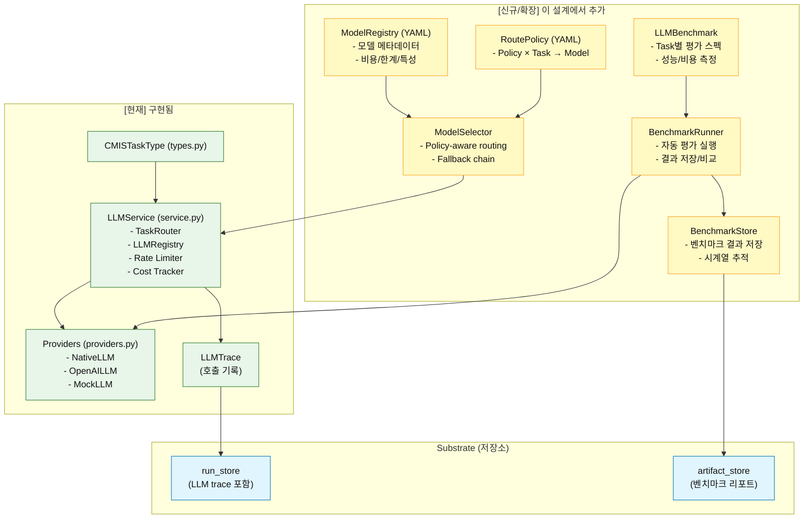

# CMIS LLM Model Management Design v1.0.0

- **문서 버전**: v1.0.0
- **작성일**: 2024-12-21
- **상태**: 설계 (구현 전)
- **목적**: CMIS의 LLM 모델 사용을 체계적으로 관리하고, 새로운 모델을 쉽게 평가/선택/업데이트할 수 있는 프레임워크 설계

---

## 0. 문서 읽는 방법

- **[현재]**: 지금 코드베이스에 구현된 상태
- **[신규]**: 이 설계에서 새로 추가할 부분
- **[확장]**: 기존 구조를 확장/개선할 부분

---

## 1. 문제 정의 및 배경

### 1.1 핵심 문제

CMIS는 다양한 작업(Evidence 추출, Pattern 인식, Prior 추정, Strategy 생성 등)에서 LLM을 사용합니다.

**현재의 한계**:

1. **하드코딩된 모델 선택**: `providers.py`와 `types.py`에 모델명이 코멘트로만 명시되어 있음
2. **평가 기준 부재**: 어떤 모델이 특정 작업에 더 적합한지 객관적으로 판단할 방법 없음
3. **업데이트 어려움**: 새 모델(GPT-4.5, Claude 3.7 등)이 출시되어도 빠르게 반영/평가하기 어려움
4. **비용/품질 트레이드오프 불투명**: 모델별 비용과 품질을 체계적으로 비교할 수 없음
5. **정책과 분리**: Policy(reporting_strict 등)와 LLM 모델 선택이 연결되지 않음

### 1.2 설계 목표

1. **선언적 모델 관리**: 모델 선택을 YAML 설정으로 관리하고, 코드 변경 없이 모델 교체 가능
2. **구조화된 벤치마크**: Task별, Policy별로 모델 성능/비용을 객관적으로 평가
3. **자동화된 평가**: 회귀 테스트처럼 모델 성능을 지속적으로 모니터링
4. **정책 기반 라우팅**: Policy(reporting_strict 등)에 따라 자동으로 적절한 모델 선택
5. **추적 가능성**: 어떤 모델이 언제, 왜 사용되었는지 Run/Ledger에 기록

---

## 2. 설계 원칙

### 2.1 핵심 원칙

1. **Model은 Tool이다**: LLM 모델은 "검증된 도구"이며, 임의 변경을 허용하지 않음
2. **Evidence-first for Models**: 모델 선택도 근거(벤치마크 결과) 기반으로만 변경
3. **Policy-aligned Routing**: Policy(reporting_strict 등)가 모델 선택의 1차 제약
4. **Cost-aware by Default**: 모든 모델 선택은 예산/비용을 고려해야 함
5. **Versioned Model Registry**: 모델 레지스트리는 버전 관리되며, 변경 이력이 남아야 함

### 2.2 CMIS 철학과의 정합성

| CMIS 철학 | LLM 모델 관리 적용 |
|---|---|
| **Evidence-first, Prior-last** | 모델 선택도 벤치마크 근거 기반, 임의 변경 금지 |
| **Substrate = SSoT** | 모델 레지스트리/벤치마크 결과를 `.cmis/` 저장 |
| **Model → Number** | 모델 성능 평가를 구조화된 지표(Metric)로 표현 |
| **Deterministic Engines, Auditable LLM** | 모델 선택 로직은 결정적, LLM 호출은 trace 기록 |
| **Monotonic Improvability** | 벤치마크 기반 모델 업그레이드, 회귀 방지 |

---

## 3. 전체 아키텍처

### 3.1 구성 요소 (As-Is vs To-Be)



### 3.2 데이터 흐름 (신규)

```text
┌──────────────────────────────────────────────────────────────┐
│ 1. 모델 등록 (개발자/운영자)                                   │
│    - config/llm/model_registry.yaml 업데이트                  │
│    - 새 Provider 구현 (필요 시)                                │
└────────────────────┬─────────────────────────────────────────┘
                     │
┌────────────────────▼─────────────────────────────────────────┐
│ 2. 벤치마크 실행 (자동/수동)                                   │
│    - cmis llm benchmark run --suite <suite_id>                │
│    - Task × Policy × Model 조합 평가                          │
│    - 결과를 .cmis/benchmarks/ 저장                            │
└────────────────────┬─────────────────────────────────────────┘
                     │
┌────────────────────▼─────────────────────────────────────────┐
│ 3. 라우팅 정책 업데이트 (증거 기반)                            │
│    - 벤치마크 결과 검토                                        │
│    - config/llm/routing_policy.yaml 업데이트                  │
│    - 변경 이유/근거를 commit message/docs에 명시               │
└────────────────────┬─────────────────────────────────────────┘
                     │
┌────────────────────▼─────────────────────────────────────────┐
│ 4. 런타임 사용 (자동)                                          │
│    - LLMService.call(task_type, ...)                          │
│    - ModelSelector가 Policy 기반 모델 선택                     │
│    - 선택 근거를 trace에 기록                                  │
└──────────────────────────────────────────────────────────────┘
```

---

## 4. 설정 파일 구조 (신규)

### 4.1 디렉토리 구조

```text
config/
├─ llm/                          # [신규] LLM 관련 설정 전용 폴더
│  ├─ model_registry.yaml        # [신규] 모델 메타데이터
│  ├─ routing_policy.yaml        # [신규] Policy × Task → Model 매핑
│  └─ benchmark_suites.yaml      # [신규] 벤치마크 스펙
│
├─ policies.yaml                 # [현재] Policy 정의 (기존 유지)
└─ ...

.cmis/
├─ benchmarks/                   # [신규] 벤치마크 결과 저장
│  ├─ runs/
│  │  └─ BENCH-20241221-001/
│  │     ├─ summary.yaml
│  │     └─ results.json
│  └─ history/
│     └─ model_performance_trend.yaml
│
├─ db/
│  └─ runs.db                    # [확장] LLM trace 저장 (기존)
└─ ...
```

### 4.2 model_registry.yaml (신규)

```yaml
---
# LLM Model Registry
# 목적: 사용 가능한 모델의 메타데이터/비용/특성 정의

schema_version: 1
last_updated: "2024-12-21"

models:
  gpt-4o-mini:
    provider: "openai"
    display_name: "GPT-4o Mini"
    version: "2024-07-18"
    capabilities:
      max_tokens: 16384
      supports_json_mode: true
      supports_streaming: true
      multimodal: false
    cost:
      input_per_1m_tokens: 0.15  # USD
      output_per_1m_tokens: 0.60
      currency: "USD"
    performance_tier: "fast"     # fast | balanced | accurate
    recommended_for:
      - "evidence_number_extraction"
      - "validation_sanity_check"
      - "value_formula_derivation"
    limitations:
      - "복잡한 추론(multi-step reasoning)에는 부족"
      - "한국어 컨텍스트 이해 제한적"

  gpt-4:
    provider: "openai"
    display_name: "GPT-4"
    version: "0613"
    capabilities:
      max_tokens: 8192
      supports_json_mode: true
      supports_streaming: true
      multimodal: false
    cost:
      input_per_1m_tokens: 30.0
      output_per_1m_tokens: 60.0
      currency: "USD"
    performance_tier: "accurate"
    recommended_for:
      - "pattern_recognition"
      - "pattern_gap_analysis"
      - "strategy_evaluation"
    limitations:
      - "속도 느림 (응답 시간 ~3-5초)"
      - "비용 높음"

  claude-3.5-sonnet:
    provider: "anthropic"
    display_name: "Claude 3.5 Sonnet"
    version: "20241022"
    capabilities:
      max_tokens: 200000
      supports_json_mode: false
      supports_streaming: true
      multimodal: true
    cost:
      input_per_1m_tokens: 3.0
      output_per_1m_tokens: 15.0
      currency: "USD"
    performance_tier: "accurate"
    recommended_for:
      - "strategy_generation"
      - "pattern_recognition"
    limitations:
      - "JSON mode 미지원 (추출 후처리 필요)"

  gpt-4.1-nano:
    provider: "openai"
    display_name: "GPT-4.1 Nano"
    version: "experimental"
    capabilities:
      max_tokens: 4096
      supports_json_mode: true
      supports_streaming: true
      multimodal: false
    cost:
      input_per_1m_tokens: 0.03
      output_per_1m_tokens: 0.06
      currency: "USD"
    performance_tier: "fast"
    recommended_for:
      - "value_prior_estimation"
    limitations:
      - "실험 모델 (프로덕션 미권장)"

  mock:
    provider: "mock"
    display_name: "Mock LLM (Test)"
    version: "1.0.0"
    capabilities:
      max_tokens: 1024
      supports_json_mode: true
      supports_streaming: false
      multimodal: false
    cost:
      input_per_1m_tokens: 0.0
      output_per_1m_tokens: 0.0
      currency: "USD"
    performance_tier: "test"
    recommended_for:
      - "testing"
    limitations:
      - "실제 LLM 호출 없음 (고정 응답)"

# Provider별 공통 설정
providers:
  openai:
    api_key_env: "OPENAI_API_KEY"
    base_url_env: "OPENAI_BASE_URL"  # 선택 (프록시/로컬 서버)
    rate_limit_default: 10000  # TPM (tokens per minute)

  anthropic:
    api_key_env: "ANTHROPIC_API_KEY"
    rate_limit_default: 5000

  mock:
    enabled: true
```

### 4.3 routing_policy.yaml (신규)

```yaml
---
# LLM Routing Policy
# 목적: Policy × Task → Model 매핑 (벤치마크 근거 기반)

schema_version: 1
last_updated: "2024-12-21"
changelog:
  - version: "1.0.0"
    date: "2024-12-21"
    changes:
      - "초기 라우팅 정책 (가설 기반)"
      - "벤치마크 완료 후 업데이트 예정"

# Policy별 기본 모델 전략
policy_defaults:
  reporting_strict:
    default_model: "gpt-4"
    fallback_chain: ["gpt-4o-mini", "mock"]
    max_cost_per_call: 0.01  # USD
    rationale: "공식 보고용으로 정확도 우선, 비용 제한"

  decision_balanced:
    default_model: "gpt-4o-mini"
    fallback_chain: ["gpt-4", "mock"]
    max_cost_per_call: 0.005
    rationale: "균형 잡힌 비용/품질"

  exploration_friendly:
    default_model: "gpt-4o-mini"
    fallback_chain: ["claude-3.5-sonnet", "gpt-4", "mock"]
    max_cost_per_call: 0.02
    rationale: "탐색용으로 다양한 모델 허용"

# Task별 오버라이드 (Policy × Task 조합)
task_overrides:
  # Evidence Layer
  evidence_account_matching:
    reporting_strict: "gpt-4o-mini"  # 가벼운 작업
    decision_balanced: "gpt-4o-mini"
    exploration_friendly: "gpt-4o-mini"
    rationale: "단순 매칭 작업, mini로 충분"

  evidence_number_extraction:
    reporting_strict: "gpt-4o-mini"
    decision_balanced: "gpt-4o-mini"
    exploration_friendly: "gpt-4o-mini"
    rationale: "숫자 추출, 빠른 모델 선호"

  # Pattern Layer
  pattern_recognition:
    reporting_strict: "gpt-4"
    decision_balanced: "gpt-4"
    exploration_friendly: "claude-3.5-sonnet"
    rationale: "복잡한 추론 필요, 정확도 중요"

  pattern_gap_analysis:
    reporting_strict: "gpt-4"
    decision_balanced: "gpt-4"
    exploration_friendly: "claude-3.5-sonnet"
    rationale: "갭 분석은 창의적 추론 필요"

  # Value Layer
  value_prior_estimation:
    reporting_strict: null  # Prior 사용 금지
    decision_balanced: "gpt-4.1-nano"
    exploration_friendly: "gpt-4o-mini"
    rationale: "Prior는 탐색/결정용, reporting_strict에서는 금지"

  value_formula_derivation:
    reporting_strict: "gpt-4o-mini"
    decision_balanced: "gpt-4o-mini"
    exploration_friendly: "gpt-4o-mini"
    rationale: "공식 유도, 규칙 기반으로도 가능"

  # Strategy Layer
  strategy_generation:
    reporting_strict: "gpt-4"
    decision_balanced: "claude-3.5-sonnet"
    exploration_friendly: "claude-3.5-sonnet"
    rationale: "창의적 전략 생성에 Claude 우수"

  strategy_evaluation:
    reporting_strict: "gpt-4"
    decision_balanced: "gpt-4"
    exploration_friendly: "gpt-4o-mini"
    rationale: "평가는 정확도 중요"

  # Validation
  validation_sanity_check:
    reporting_strict: "gpt-4o-mini"
    decision_balanced: "gpt-4o-mini"
    exploration_friendly: "gpt-4o-mini"
    rationale: "상식 검증, 빠른 모델로 충분"

# 모델별 제약 조건
model_constraints:
  gpt-4:
    max_concurrent_calls: 5     # 동시 호출 제한 (비용/속도)
    timeout_seconds: 30

  gpt-4o-mini:
    max_concurrent_calls: 20
    timeout_seconds: 10

  claude-3.5-sonnet:
    max_concurrent_calls: 10
    timeout_seconds: 20

  mock:
    max_concurrent_calls: 100
    timeout_seconds: 1
```

### 4.4 benchmark_suites.yaml (신규)

```yaml
---
# LLM Benchmark Suites
# 목적: 모델 성능을 평가할 벤치마크 스펙 정의

schema_version: 1
last_updated: "2024-12-21"

benchmark_suites:
  evidence_extraction_suite:
    description: "Evidence 추출 작업 벤치마크"
    tasks:
      - task_type: "evidence_account_matching"
        test_cases:
          - id: "account-match-001"
            input_prompt: "DART 계정과목 '매출액'을 표준 계정으로 매칭"
            expected_output:
              account_code: "ACC-REVENUE"
              confidence: ">0.9"
            evaluation_criteria:
              - metric: "exact_match"
                weight: 0.7
              - metric: "latency_ms"
                weight: 0.3
                threshold: 2000

          - id: "account-match-002"
            input_prompt: "DART 계정과목 '판매비와관리비'를 표준 계정으로 매칭"
            expected_output:
              account_code: "ACC-SGA"
              confidence: ">0.9"
            evaluation_criteria:
              - metric: "exact_match"
                weight: 0.7
              - metric: "latency_ms"
                weight: 0.3
                threshold: 2000

      - task_type: "evidence_number_extraction"
        test_cases:
          - id: "number-extract-001"
            input_prompt: "텍스트: '2023년 매출은 100억원 증가' → 숫자 추출"
            expected_output:
              value: 10000000000
              unit: "KRW"
              year: 2023
            evaluation_criteria:
              - metric: "value_accuracy"
                weight: 0.8
              - metric: "latency_ms"
                weight: 0.2
                threshold: 1500

  pattern_analysis_suite:
    description: "Pattern 인식/분석 벤치마크"
    tasks:
      - task_type: "pattern_recognition"
        test_cases:
          - id: "pattern-recog-001"
            input_prompt: "R-Graph: [시장 구조 설명] → 패턴 인식"
            expected_output:
              patterns:
                - "winner_takes_all"
                - "platform_network_effect"
              confidence: ">0.7"
            evaluation_criteria:
              - metric: "pattern_recall"
                weight: 0.6
              - metric: "pattern_precision"
                weight: 0.4

  value_estimation_suite:
    description: "Value 추정 벤치마크"
    tasks:
      - task_type: "value_prior_estimation"
        test_cases:
          - id: "prior-est-001"
            input_prompt: "한국 어학 시장 TAM 추정 (증거 없음)"
            expected_output:
              value_range: [500000000000, 2000000000000]  # 5천억~2조
              unit: "KRW"
            evaluation_criteria:
              - metric: "range_reasonableness"
                weight: 0.7
              - metric: "justification_quality"
                weight: 0.3

  strategy_generation_suite:
    description: "Strategy 생성 벤치마크"
    tasks:
      - task_type: "strategy_generation"
        test_cases:
          - id: "strategy-gen-001"
            input_prompt: "Goal: 한국 어학 시장 진입 전략 (Brownfield Actor)"
            expected_output:
              strategies_count: ">=3"
              diversity_score: ">0.6"
            evaluation_criteria:
              - metric: "strategy_diversity"
                weight: 0.5
              - metric: "strategy_feasibility"
                weight: 0.3
              - metric: "creativity_score"
                weight: 0.2

# 평가 지표 정의
evaluation_metrics:
  exact_match:
    description: "정답과 정확히 일치하는지"
    scoring: "binary"  # 0 or 1

  latency_ms:
    description: "응답 시간 (밀리초)"
    scoring: "numeric"
    lower_is_better: true

  value_accuracy:
    description: "숫자 값 정확도 (상대 오차)"
    scoring: "percentage"  # 0~100
    threshold: 95  # 95% 이상이면 pass

  pattern_recall:
    description: "실제 패턴 중 얼마나 찾았는지"
    scoring: "percentage"

  pattern_precision:
    description: "찾은 패턴 중 올바른 비율"
    scoring: "percentage"

  range_reasonableness:
    description: "추정 범위가 합리적인지 (전문가 평가)"
    scoring: "likert"  # 1~5 척도

  justification_quality:
    description: "추론 근거의 품질 (전문가 평가)"
    scoring: "likert"

  strategy_diversity:
    description: "전략 후보의 다양성 (코사인 유사도 기반)"
    scoring: "percentage"

  strategy_feasibility:
    description: "전략의 실현 가능성 (전문가 평가)"
    scoring: "likert"

  creativity_score:
    description: "전략의 창의성 (전문가 평가)"
    scoring: "likert"

# 벤치마크 실행 설정
execution_config:
  default_timeout_seconds: 30
  retry_on_failure: false  # 벤치마크는 실패도 기록
  save_full_trace: true    # LLM 호출 전체 기록
  parallel_execution: true
  max_parallel_tasks: 5
```

---

## 5. 벤치마크 프레임워크 (신규)

### 5.1 벤치마크 목적

1. **모델 선택 근거 제공**: Task별로 어떤 모델이 최적인지 객관적 데이터 제공
2. **회귀 방지**: 모델 업데이트 후 성능 저하 감지
3. **비용/품질 트레이드오프**: 동일 작업에서 모델별 비용 대비 성능 비교
4. **지속적 개선**: 새 모델 출시 시 빠르게 평가하고 반영

### 5.2 벤치마크 구조

```python
# cmis_core/llm/benchmark.py (신규)

@dataclass
class BenchmarkTestCase:
    """단일 테스트 케이스"""
    id: str
    task_type: CMISTaskType
    input_prompt: str
    expected_output: Dict[str, Any]
    evaluation_criteria: List[EvaluationCriterion]

@dataclass
class BenchmarkResult:
    """벤치마크 결과"""
    test_case_id: str
    model_id: str
    policy_id: str
    
    # 성능
    score: float  # 0~1
    latency_ms: float
    tokens_used: int
    cost_usd: float
    
    # 추적
    timestamp: str
    trace_ref: str  # run_store에 저장된 trace ID
    
    # 평가
    passed: bool
    failures: List[str]

@dataclass
class BenchmarkSuiteResult:
    """벤치마크 스위트 결과"""
    suite_id: str
    bench_run_id: str
    started_at: str
    ended_at: str
    
    # 결과
    results: List[BenchmarkResult]
    
    # 요약
    summary: Dict[str, Any]  # model별, task별 집계
```

### 5.3 벤치마크 실행 흐름

```text
┌─────────────────────────────────────────────────────────────┐
│ cmis llm benchmark run --suite evidence_extraction_suite    │
└────────────────────┬────────────────────────────────────────┘
                     │
┌────────────────────▼────────────────────────────────────────┐
│ 1. 스위트 로드                                               │
│    - config/llm/benchmark_suites.yaml 읽기                  │
│    - 테스트 케이스 × 모델 × Policy 조합 생성                 │
└────────────────────┬────────────────────────────────────────┘
                     │
┌────────────────────▼────────────────────────────────────────┐
│ 2. 실행 (병렬)                                               │
│    - 각 조합별로 LLMService.call() 호출                      │
│    - 응답 시간/비용/토큰 수 측정                              │
│    - expected_output과 비교 (평가 지표 계산)                 │
└────────────────────┬────────────────────────────────────────┘
                     │
┌────────────────────▼────────────────────────────────────────┐
│ 3. 결과 저장                                                 │
│    - .cmis/benchmarks/runs/BENCH-<timestamp>-<id>/          │
│    - summary.yaml (요약), results.json (상세)               │
│    - artifact_store에 리포트 저장                            │
└────────────────────┬────────────────────────────────────────┘
                     │
┌────────────────────▼────────────────────────────────────────┐
│ 4. 리포트 생성                                               │
│    - 모델별 비교 테이블 (점수/비용/속도)                     │
│    - 추천 모델 (Task × Policy 기준)                         │
│    - 회귀 감지 (이전 벤치마크와 비교)                        │
└──────────────────────────────────────────────────────────────┘
```

### 5.4 벤치마크 출력 예시

```yaml
# .cmis/benchmarks/runs/BENCH-20241221-001/summary.yaml

bench_run_id: "BENCH-20241221-001"
suite_id: "evidence_extraction_suite"
started_at: "2024-12-21T10:00:00Z"
ended_at: "2024-12-21T10:05:32Z"

summary:
  total_test_cases: 4
  total_combinations: 12  # 4 cases × 3 models
  passed: 10
  failed: 2

model_comparison:
  evidence_account_matching:
    gpt-4o-mini:
      avg_score: 0.95
      avg_latency_ms: 850
      avg_cost_usd: 0.0002
      pass_rate: 1.0
    gpt-4:
      avg_score: 0.98
      avg_latency_ms: 3200
      avg_cost_usd: 0.0012
      pass_rate: 1.0
    mock:
      avg_score: 0.50
      avg_latency_ms: 10
      avg_cost_usd: 0.0
      pass_rate: 0.0

  evidence_number_extraction:
    gpt-4o-mini:
      avg_score: 0.92
      avg_latency_ms: 720
      avg_cost_usd: 0.00015
      pass_rate: 1.0
    gpt-4:
      avg_score: 0.95
      avg_latency_ms: 2800
      avg_cost_usd: 0.001
      pass_rate: 1.0

recommendations:
  evidence_account_matching:
    best_overall: "gpt-4o-mini"
    rationale: "gpt-4와 유사한 점수(0.95 vs 0.98), 비용 1/6, 속도 3.8배"
  
  evidence_number_extraction:
    best_overall: "gpt-4o-mini"
    rationale: "점수 차이 3%p, 비용/속도 우수"

regression_alerts: []  # 이전 벤치마크 대비 성능 저하 없음
```

---

## 6. 모델 선택/업데이트 프로세스 (운영 가이드)

### 6.1 새 모델 추가 프로세스

```text
┌──────────────────────────────────────────────────────────────┐
│ Step 1: 모델 등록                                             │
│ - config/llm/model_registry.yaml에 메타데이터 추가            │
│ - Provider 구현 필요 시 cmis_core/llm/providers.py 확장      │
└────────────────────┬─────────────────────────────────────────┘
                     │
┌────────────────────▼─────────────────────────────────────────┐
│ Step 2: 초기 벤치마크 실행                                     │
│ - cmis llm benchmark run --suite <all_suites>                │
│ - 모든 Task × Policy 조합에서 성능 측정                       │
└────────────────────┬─────────────────────────────────────────┘
                     │
┌────────────────────▼─────────────────────────────────────────┐
│ Step 3: 결과 검토 및 라우팅 정책 업데이트                      │
│ - 벤치마크 리포트 분석                                         │
│ - config/llm/routing_policy.yaml 업데이트                    │
│ - 변경 근거를 changelog에 명시                                │
└────────────────────┬─────────────────────────────────────────┘
                     │
┌────────────────────▼─────────────────────────────────────────┐
│ Step 4: 회귀 테스트                                            │
│ - cmis eval run --suite regression_suite                     │
│ - End-to-end 워크플로우가 정상 동작하는지 확인                 │
└────────────────────┬─────────────────────────────────────────┘
                     │
┌────────────────────▼─────────────────────────────────────────┐
│ Step 5: 문서화 및 배포                                         │
│ - dev/docs/llm/model_update_log.md 업데이트                  │
│ - Git commit + PR (리뷰)                                      │
│ - 배포 (config 파일만 변경되므로 재배포 불필요)                │
└──────────────────────────────────────────────────────────────┘
```

### 6.2 정기 모니터링 (자동화)

```yaml
# 주간/월간 자동 벤치마크 (CI/CD 통합)

schedule:
  weekly:
    - suite: "evidence_extraction_suite"
      models: ["gpt-4o-mini", "gpt-4"]
      policies: ["reporting_strict", "decision_balanced"]
    
  monthly:
    - suite: "all"
      models: "all"
      policies: "all"

alerts:
  regression_threshold: 0.05  # 5% 이상 성능 저하 시 알림
  cost_increase_threshold: 0.2  # 20% 이상 비용 증가 시 알림
  
notification:
  slack_webhook: "${SLACK_WEBHOOK_URL}"
  email: "cmis-ops@example.com"
```

---

## 7. 구현 로드맵

### 7.1 Phase 1: 기초 인프라 (우선순위 높음)

**목표**: 모델 레지스트리와 라우팅 정책을 설정 파일로 관리

| 작업 | 산출물 | 예상 공수 |
|---|---|---|
| config/llm/ 디렉토리 생성 | 3개 YAML 파일 (registry/routing/benchmark_suites) | 1일 |
| ModelRegistry 클래스 구현 | cmis_core/llm/model_registry.py | 1일 |
| ModelSelector 클래스 구현 | cmis_core/llm/model_selector.py | 1일 |
| LLMService 통합 | service.py 수정 (TaskRouter → ModelSelector) | 0.5일 |
| 단위 테스트 | dev/tests/test_llm_model_selector.py | 0.5일 |

**Total**: 4일

### 7.2 Phase 2: 벤치마크 프레임워크 (우선순위 중)

**목표**: 자동화된 벤치마크 실행 및 결과 저장

| 작업 | 산출물 | 예상 공수 |
|---|---|---|
| BenchmarkRunner 구현 | cmis_core/llm/benchmark.py | 2일 |
| BenchmarkStore 구현 | .cmis/benchmarks/ 저장 로직 | 1일 |
| CLI 명령 추가 | cmis llm benchmark run/report | 1일 |
| 평가 지표 구현 | exact_match, latency 등 | 1일 |
| 초기 벤치마크 스위트 작성 | evidence/pattern/value 스위트 | 1일 |
| 통합 테스트 | 전체 벤치마크 실행 테스트 | 0.5일 |

**Total**: 6.5일

### 7.3 Phase 3: 자동화 및 모니터링 (우선순위 낮음)

**목표**: CI/CD 통합 및 회귀 감지 자동화

| 작업 | 산출물 | 예상 공수 |
|---|---|---|
| 회귀 감지 로직 | 이전 결과와 비교 알고리즘 | 1일 |
| CI/CD 통합 | GitHub Actions workflow | 0.5일 |
| 알림 연동 | Slack/이메일 알림 | 0.5일 |
| 대시보드 (선택) | 웹 기반 벤치마크 결과 조회 | 3일 (선택) |

**Total**: 2일 (대시보드 제외)

### 7.4 전체 로드맵 요약

| Phase | 목표 | 공수 | 우선순위 |
|---|---|---|---|
| Phase 1 | 기초 인프라 | 4일 | 높음 |
| Phase 2 | 벤치마크 프레임워크 | 6.5일 | 중 |
| Phase 3 | 자동화/모니터링 | 2일 | 낮음 |
| **Total** | | **12.5일** | |

---

## 8. 파일 위치 및 네이밍 규칙

### 8.1 신규 파일 목록

```text
config/
└─ llm/
   ├─ model_registry.yaml         # [신규] 모델 메타데이터
   ├─ routing_policy.yaml         # [신규] Policy × Task → Model
   └─ benchmark_suites.yaml       # [신규] 벤치마크 스펙

cmis_core/
└─ llm/
   ├─ model_registry.py           # [신규] ModelRegistry 클래스
   ├─ model_selector.py           # [신규] ModelSelector 클래스
   └─ benchmark.py                # [신규] BenchmarkRunner, 평가 로직

cmis_cli/
└─ commands/
   └─ llm_manage.py               # [신규] CLI: cmis llm benchmark/report

dev/
├─ docs/
│  ├─ architecture/
│  │  └─ CMIS_LLM_Model_Management_Design_v1.0.0.md  # [이 문서]
│  └─ llm/
│     └─ model_update_log.md     # [신규] 모델 업데이트 이력
│
└─ tests/
   └─ test_llm_model_selector.py # [신규] 단위 테스트

.cmis/
└─ benchmarks/                    # [신규] 벤치마크 결과 저장
   ├─ runs/
   │  └─ BENCH-<timestamp>-<id>/
   │     ├─ summary.yaml
   │     └─ results.json
   └─ history/
      └─ model_performance_trend.yaml
```

### 8.2 네이밍 규칙

- **Benchmark Run ID**: `BENCH-YYYYMMDD-HHMMSS-<hex6>`
- **Model ID**: 소문자, 하이픈 구분 (예: `gpt-4o-mini`, `claude-3.5-sonnet`)
- **Suite ID**: 스네이크 케이스 (예: `evidence_extraction_suite`)
- **Test Case ID**: 케밥 케이스 + 일련번호 (예: `account-match-001`)

---

## 9. 구현 시 고려사항

### 9.1 Policy 연동

**중요**: `routing_policy.yaml`의 모델 선택은 `config/policies.yaml`의 Policy 모드와 일관성을 유지해야 합니다.

예시:
- `reporting_strict`에서는 `value_prior_estimation` 작업이 **금지**되어야 함
- ModelSelector는 Policy에 금지된 Task 요청 시 예외 발생 또는 null 반환

```python
# cmis_core/llm/model_selector.py (의사 코드)

class ModelSelector:
    def select_model(
        self,
        task_type: CMISTaskType,
        policy_id: str
    ) -> Optional[str]:
        # 1. Policy 제약 확인
        if self._is_task_forbidden_by_policy(task_type, policy_id):
            logger.warning(f"{task_type} forbidden by {policy_id}")
            return None
        
        # 2. routing_policy.yaml에서 모델 조회
        model_id = self._lookup_routing_policy(task_type, policy_id)
        
        # 3. Fallback chain
        if not model_id or not self._is_model_available(model_id):
            model_id = self._get_fallback_model(policy_id)
        
        return model_id
```

### 9.2 비용 추적

**중요**: 벤치마크는 비용이 발생하는 작업이므로, 실행 전 예상 비용을 출력하고 확인받아야 합니다.

```bash
$ cmis llm benchmark run --suite all --dry-run

Benchmark Plan:
  Suite: all (4 suites)
  Test cases: 20
  Models: 4 (gpt-4, gpt-4o-mini, claude-3.5-sonnet, mock)
  Policies: 3 (reporting_strict, decision_balanced, exploration_friendly)
  Total combinations: 240

Estimated cost: $2.45 USD
Estimated time: 45 minutes

Proceed? [y/N]:
```

### 9.3 Provider 확장

새 Provider(Anthropic, Gemini 등) 추가 시:

1. `cmis_core/llm/providers.py`에 클래스 구현
2. `config/llm/model_registry.yaml`에 provider 섹션 추가
3. `LLMRegistry._create_provider()` 수정

### 9.4 보안

- API 키는 환경변수로만 관리 (`model_registry.yaml`에 하드코딩 금지)
- 벤치마크 결과에 민감 정보(프롬프트 원문 등) 포함 시 redaction 적용

---

## 10. 성공 기준

### 10.1 Phase 1 완료 조건

- [ ] config/llm/ 디렉토리에 3개 YAML 파일 생성
- [ ] ModelSelector가 Policy × Task 기반으로 모델 선택
- [ ] LLMService에서 ModelSelector 사용
- [ ] 단위 테스트 통과 (>90% 커버리지)
- [ ] cmis.yaml 업데이트 (llm_runtime 섹션 확장)

### 10.2 Phase 2 완료 조건

- [ ] `cmis llm benchmark run` 명령 동작
- [ ] 벤치마크 결과가 `.cmis/benchmarks/` 저장
- [ ] 요약 리포트 자동 생성 (summary.yaml)
- [ ] 모델별 비교 테이블 출력
- [ ] 회귀 테스트 통과 (기존 워크플로우 정상 동작)

### 10.3 Phase 3 완료 조건

- [ ] CI/CD에서 주간 벤치마크 자동 실행
- [ ] 회귀 감지 시 알림 발송
- [ ] dev/docs/llm/model_update_log.md 최신 상태 유지

---

## 11. 참조 문서

- **cmis.yaml**: v3.6.0, `cmis.planes.cognition_plane.llm_runtime`
- **CMIS_Architecture_Blueprint_v3.6.1_km.md**: 전체 아키텍처 문맥
- **config/policies.yaml**: Policy 정의 (기존)
- **eval/regression_suite.yaml**: 회귀 테스트 스펙 (벤치마크와 유사 구조)

---

## 12. 변경 이력

| 버전 | 날짜 | 변경 내용 |
|---|---|---|
| v1.0.0 | 2024-12-21 | 초기 설계 문서 작성 |

---

**문서 끝**

