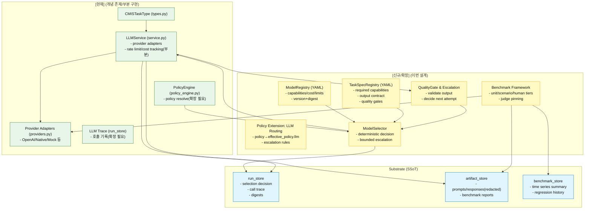

# CMIS LLM Model Management Design v1.1.0 (Rewrite)

- **문서 버전**: v1.1.0 (v1.0.0 전면 재작성)
- **작성일**: 2025-12-21
- **상태**: 설계 (구현 전)
- **목적**: CMIS의 LLM 사용을 “자율성(동적 대응) 중심”으로 설계하되, 최소 커널(정책/SSoT/감사/리플레이)만으로 안전·비용·품질을 운영 가능하게 만드는 모델/라우팅/평가 프레임워크를 정의합니다.

---

## 0. 문서 읽는 방법

- **[현재]**: 코드베이스에 존재(또는 유사 개념 존재)
- **[신규]**: 이번 설계에서 추가
- **[확장]**: 기존 구조를 확장/정렬

---

## 1. 문제 정의

### 1.1 우리가 만들고자 하는 것(북극성)

CMIS의 핵심 경쟁력은 **LLM의 자율적 판단(상황 진단)과 전술 선택, 동적 재계획**을 통해 다양한 리서치/전략 상황에 유연하게 대응하면서도, 시스템 구조는 **낮은 복잡도의 간결한 커널**로 유지하는 것입니다.

이때 “모델 관리”는 LLM을 통제하기 위한 목적이 아니라, LLM의 자율성을 **현업 수준 결과물로 승격**시키기 위한 최소 커널입니다.

### 1.2 현재의 한계(대표적인 실패 모드)

1) **모델 선택 하드코딩/산재**
- provider 코드나 주석에 모델명이 암묵적으로 박혀 있으면, Task별 최적화/업데이트/회귀 검증이 어렵습니다.

2) **정책 SSoT 불명확**
- Policy(reporting_strict 등)와 모델 선택이 분리되면 “정책이 두 군데에서 정의”되어 drift가 발생합니다.

3) **품질 실패 후 동적 대응(에스컬레이션) 구조 부재**
- JSON 파싱 실패, 누락, 환각 등 “실패 유형”에 따라 다음 행동(모델 변경/프롬프트 변경/검증 강화)을 선택하는 구조가 약합니다.

4) **평가/업데이트가 증거 기반으로 고정되지 않음**
- 새 모델이 나와도 “어떤 Task/Policy에서 어떤 모델이 더 좋은지”를 객관적으로 쌓지 못하면 운영 품질이 흔들립니다.

5) **추적/리플레이 단위가 모호**
- LLM은 본질적으로 비결정적일 수 있으므로, “동일 토큰 출력”이 아니라 “동일 trace replay(선택된 행동/도구 호출/스냅샷)”로 재현을 정의해야 합니다.

---

## 2. 설계 목표

1) **LLM-native, bounded adaptivity**
- LLM은 자율 컨트롤러이며, 모델 선택은 policy/예산/보안/능력(capability) 범위 안에서 **동적으로 최적 선택/에스컬레이션**할 수 있어야 합니다.

2) **정책 SSoT 단일화**
- 모델 라우팅은 `policies.yaml`(SSoT)에서 파생되는 **effective_policy**의 일부로 취급합니다.  
  별도의 “정책 파일”이 아니라 PolicyEngine이 resolve한 결과를 집행합니다.

3) **선언적 레지스트리 + 결정적 선택**
- 모델 메타데이터, Task 요구 capability, 벤치마크 스펙은 YAML로 관리합니다.
- `effective_policy + registry digests + request`가 같으면 **ModelSelector의 선택은 결정적**이어야 합니다.

4) **감사 가능(Trace) + 리플레이 중심 재현성**
- run_store에 “선택 근거/버전/파라미터/프롬프트/아티팩트 ref”를 남깁니다.
- 재현성은 토큰 동일성 대신 **trace replay**로 보장합니다.

5) **Monotonic improvability**
- 모델/프롬프트/라우팅 변경은 벤치마크(증거) 기반으로만 승격합니다.
- 온라인 무음 변경을 금지하고, 회귀를 자동 감지합니다.

---

## 3. 설계 원칙(CMIS 철학 정렬)

### 3.1 핵심 원칙

1) **Model is a governed resource**
- LLM은 자율 컨트롤러이지만, 사용할 모델/모드/예산은 PolicyEngine이 해석한 정책으로 제한됩니다.
- “임의 변경 금지”는 “고정”이 아니라, **허용된 집합 내 최적 선택**과 **정해진 에스컬레이션 사다리**를 의미합니다.

2) **Policy is SSoT**
- 모델 라우팅 정책은 별도 SSoT가 아닙니다.
- PolicyEngine이 `policy_ref + confidentiality + runtime caps(레지스트리/도구)`를 resolve하여 `effective_policy`를 만들고, 모든 선택은 이를 집행합니다.

3) **Deterministic selection, auditable execution**
- ModelSelector의 선택은 결정적이어야 합니다.
- LLM 실행은 비결정적일 수 있으므로 trace를 통해 감사/리플레이가 가능해야 합니다.

4) **Complexity moves to registries, not code**
- 모델/태스크 요구사항/벤치마크 스펙은 YAML + 버전/다이제스트로 관리합니다.
- 코드는 커널(해석/선택/집행/기록)만 유지합니다.

5) **Benchmarks are evidence for model changes**
- “좋아 보인다”가 아니라 벤치마크(증거)로만 변경을 승인합니다.

---

## 4. 전체 아키텍처

### 4.1 컴포넌트 개요(As-Is vs To-Be)



### 4.2 핵심 설계 포인트(정렬)

- **PolicyEngine이 LLM 라우팅을 포함한 effective_policy를 생성**합니다.  
  ModelSelector는 policy_id를 직접 해석하지 않고, resolve된 결과만 집행합니다.
- ModelSelector는 **결정적 선택 + bounded escalation**을 제공합니다.
- “모델 업데이트”는 벤치마크(증거) 기반의 버전 승격으로만 반영됩니다.

---

## 5. 데이터 계약(Contracts)

### 5.1 ModelSpec (ModelRegistry)

```yaml
# config/llm/model_registry.yaml (예시)
schema_version: 1
last_updated: "2025-12-21"
registry_version: "1.1.0"

models:
  gpt-4o-mini:
    provider: "openai"
    display_name: "GPT-4o mini"
    version: "2024-07-18"
    capabilities:
      max_input_tokens: 16384
      max_output_tokens: 4096
      supports_json_mode: true
      supports_tool_calling: true
      multimodal: false
    cost_model:
      currency: "USD"
      input_per_1m_tokens: 0.15
      output_per_1m_tokens: 0.60
    performance_tier: "fast"  # fast|balanced|accurate
    availability:
      allowed_profiles: ["dev", "test", "prod"]

  claude-3.5-sonnet:
    provider: "anthropic"
    display_name: "Claude 3.5 Sonnet"
    version: "20241022"
    capabilities:
      max_input_tokens: 200000
      max_output_tokens: 8192
      supports_json_mode: false
      supports_tool_calling: false
      multimodal: true
    cost_model:
      currency: "USD"
      input_per_1m_tokens: 3.0
      output_per_1m_tokens: 15.0
    performance_tier: "accurate"
    availability:
      allowed_profiles: ["dev", "test", "prod"]

  mock:
    provider: "mock"
    display_name: "Mock (Test Only)"
    version: "1.0.0"
    capabilities:
      max_input_tokens: 1024
      max_output_tokens: 1024
      supports_json_mode: true
      supports_tool_calling: false
      multimodal: false
    cost_model:
      currency: "USD"
      input_per_1m_tokens: 0.0
      output_per_1m_tokens: 0.0
    performance_tier: "test"
    availability:
      allowed_profiles: ["dev", "test"]  # prod 금지(원칙)
```

### 5.2 TaskSpec (TaskSpecRegistry) — "요구 능력/출력 계약/품질 게이트" 1급화

#### 5.2.1 전체 스키마

```yaml
# config/llm/task_specs.yaml
schema_version: 1
last_updated: "2025-12-21"
registry_version: "1.1.0"

tasks:
  evidence_number_extraction:
    required_capabilities:
      supports_json_mode: true
      min_max_input_tokens: 8000
    output_contract:
      format: "json"
      json_schema_ref: "schemas/evidence_number_extraction.schema.json"
    quality_gates:
      - gate_id: "json_parseable"
      - gate_id: "schema_valid"
      - gate_id: "unit_present"
      - gate_id: "asof_present_or_explicit_unknown"

  pattern_recognition:
    required_capabilities:
      supports_json_mode: false
      min_max_input_tokens: 16000
    output_contract:
      format: "structured_text"
    quality_gates:
      - gate_id: "has_claims"
      - gate_id: "has_rationale"
      - gate_id: "no_policy_violations"

  value_prior_estimation:
    required_capabilities:
      supports_json_mode: false
    output_contract:
      format: "structured_text"
    policy_constraints:
      forbidden_in_policies: ["reporting_strict"]

  # (나머지 Task는 default spec 사용)
  _default:
    required_capabilities: {}
    output_contract:
      format: "text"
    quality_gates: []
```

#### 5.2.2 Phase 1 최소 범위 (초기 구현 부담 완화)

Phase 1에서는 **핵심 3개 Task만** 명시적으로 정의하고, 나머지는 `_default` spec으로 fallback합니다.

```yaml
# config/llm/task_specs_minimal.yaml (Phase 1용)
schema_version: 1
registry_version: "1.1.0-alpha"

tasks:
  # 1. Evidence 계층 대표
  evidence_number_extraction:
    required_capabilities:
      supports_json_mode: true
    output_contract:
      format: "json"
    quality_gates:
      - gate_id: "json_parseable"

  # 2. Pattern 계층 대표
  pattern_recognition:
    required_capabilities:
      min_max_input_tokens: 16000
    output_contract:
      format: "structured_text"
    quality_gates:
      - gate_id: "has_claims"

  # 3. Strategy 계층 대표
  strategy_generation:
    required_capabilities:
      min_max_input_tokens: 16000
    output_contract:
      format: "structured_text"
    quality_gates:
      - gate_id: "has_strategies"

  # Default (나머지 모든 Task)
  _default:
    required_capabilities: {}
    output_contract:
      format: "text"
    quality_gates: []
```

**Phase 2에서 확장**: 나머지 7개 Task 스펙 추가 (전체 10개)

### 5.3 EffectivePolicy.llm — PolicyEngine이 산출하는 "resolved policy 결과"

> 주의: 아래는 "설정 파일"이 아니라 PolicyEngine이 resolve해서 만드는 결과 형식(계약)입니다.  
> run_store에는 `policy_ref` + `effective_policy_digest`를 핀(pin)합니다.

#### 5.3.1 effective_policy 캐싱 전략

**문제**: 매 요청마다 PolicyEngine이 해석하면 오버헤드 발생

**해결**: digest 기반 캐싱

```python
# cmis_core/policy_engine.py (의사 코드)

class PolicyEngine:
    def __init__(self):
        self._effective_policy_cache: Dict[str, EffectivePolicy] = {}

    def resolve(self, policy_ref: str) -> EffectivePolicy:
        # 1. policy_ref로 정책 파일 로드
        policy_doc = self._load_policy(policy_ref)

        # 2. digest 계산 (정책 내용 + 확장 파일 내용)
        digest = self._compute_digest(policy_doc)

        # 3. 캐시 확인
        cache_key = f"{policy_ref}@{digest}"
        if cache_key in self._effective_policy_cache:
            return self._effective_policy_cache[cache_key]

        # 4. resolve (llm_routing 확장 merge)
        effective = self._do_resolve(policy_ref, policy_doc)
        effective.effective_policy_digest = digest

        # 5. 캐시 저장
        self._effective_policy_cache[cache_key] = effective
        return effective
```

**캐시 무효화**: 정책 파일 변경 시 (파일 watcher 또는 수동 clear)

```yaml
effective_policy:
  policy_ref: "policy:reporting_strict@v3"
  effective_policy_digest: "sha256:..."
  llm:
    execution_profile: "prod"
    max_cost_per_call_usd: 0.01
    default_tier_preference: ["accurate", "balanced", "fast"]
    allow_models: ["gpt-4", "gpt-4o-mini"]  # mock 금지 등
    forbidden_tasks: ["value_prior_estimation"]
    task_overrides:
      evidence_number_extraction:
        preferred_models: ["gpt-4o-mini", "gpt-4"]
        escalation_ladder:
          - when: "gate_failed:json_parseable"
            next: { model: "gpt-4o-mini", prompt_profile: "strict_json" }
          - when: "gate_failed:schema_valid"
            next: { model: "gpt-4", prompt_profile: "strict_json" }
      pattern_recognition:
        preferred_models: ["gpt-4", "claude-3.5-sonnet"]  # (capability 체크 후 사용)
```

---

## 6. 런타임 선택/에스컬레이션(핵심)

### 6.1 ModelSelector 입력/출력 계약

#### SelectionRequest (입력)
- 단순히 task_type만 받지 않습니다. “LLM 자율 컨트롤러의 의도”와 “운영 제약”을 함께 받습니다.

```python
@dataclass(frozen=True)
class SelectionRequest:
    task_type: str
    policy_ref: str
    effective_policy_digest: str

    # 의도/품질 힌트 (LLM-native)
    call_intent: str  # "draft"|"extract"|"judge"|"finalize"|"repair"
    quality_target: str  # "low"|"medium"|"high"

    # 실행 제약
    confidentiality: str  # "public"|"internal"|"confidential"
    budget_remaining_usd: float
    max_latency_ms: int | None

    # 반복 시도/실패 이력
    attempt_index: int
    failure_codes: list[str]  # ["json_parse_failed", "schema_failed", ...]
```

#### SelectionDecision (출력)
- 결정은 결정적이어야 하며, 근거는 code(ReasonCode)로 남겨야 합니다.

```python
@dataclass(frozen=True)
class SelectionDecision:
    decision_id: str
    model_id: str
    provider: str
    prompt_profile: str  # "default"|"strict_json"|"deep_reasoning"...
    rationale_codes: list[str]  # ["preferred_by_policy", "meets_capabilities", "within_budget", ...]
    estimated_cost_usd: float | None
    registry_digest: str
    task_spec_digest: str
    effective_policy_digest: str
```

### 6.2 선택 알고리즘(결정적)

ModelSelector는 다음 순서로 후보를 좁힙니다.

1) **정책 허용 집합**: `effective_policy.llm.allow_models`  
2) **실행 프로파일 허용**: model_registry.availability.allowed_profiles  
3) **Task 요구 capability 충족**: task_specs.required_capabilities  
4) **예산/지연 제약**: max_cost_per_call/budget_remaining/max_latency  
5) **선호/티어/벤치마크 스코어 기반 정렬**:  
   - policy preferred_models 우선  
   - tier_preference 반영  
   - benchmark score(있으면) 반영  
6) **결정**: 1개 선택 + fallback 후보 체인(내부적으로 유지)

> 여기서 LLM이 “모델을 직접 고르는” 구조가 아니라, LLM은 call_intent/quality_target 같은 힌트를 제공하고, 최종 선택은 정책/레지스트리/벤치마크에 의해 결정됩니다.  
> 이것이 CMIS의 “자율성 + 운영 가능성” 균형입니다.

### 6.3 QualityGate & Escalation( bounded adaptivity )

LLM 호출 후 출력은 TaskSpec의 quality gate로 검증합니다.

- 성공: 결과 채택
- 실패: failure_code 기록 → policy에 정의된 escalation_ladder를 따라 다음 시도
- ladder가 없거나 예산 초과: 명시적 실패(또는 사용자 입력 요청)

예시 failure codes:
- `json_parse_failed`
- `schema_failed`
- `missing_required_fields`
- `policy_violation`
- `low_confidence`

---

## 7. Trace / 저장(SSoT)

### 7.1 run_store에 남겨야 하는 것(최소 필수)

- policy_ref
- effective_policy_digest
- model_registry_digest
- task_spec_digest
- selection_decision (decision_id, model_id, rationale_codes, prompt_profile)
- call metrics (tokens, latency, cost, retries)
- prompt/response는 원문이 아니라 **artifact refs + redaction metadata**

### 7.2 artifact_store 저장 원칙

- 프롬프트/응답 원문은 민감할 수 있으므로:
  - 기본: redaction 적용 후 저장
  - 또는 confidentiality=confidential인 경우 “요약/해시/구조화 결과만” 저장(정책으로 통제)
- run_store에는 원문을 넣지 않고 ART ref만 남깁니다.

---

## 8. 설정 파일 구조(권장)

### 8.1 디렉토리 구조

```text
config/
├─ policies.yaml                         # SSoT (기존)
├─ policy_extensions/
│  └─ llm_routing.yaml                   # [신규] LLM 라우팅 확장(PolicyEngine이 merge)
└─ llm/
   ├─ model_registry.yaml                # [신규] 모델 메타/비용/능력
   ├─ task_specs.yaml                    # [신규] Task 요구 capability + gate
   └─ benchmark_suites.yaml              # [신규] 벤치마크 스펙

.cmis/
├─ benchmarks/
│  ├─ runs/                              # 벤치마크 실행 결과
│  └─ history/                           # 시계열/회귀 기록
└─ db/
   └─ runs.db                            # run_store (LLM trace 포함)
```

### 8.2 policy_extensions/llm_routing.yaml (예시)

```yaml
schema_version: 1
last_updated: "2025-12-21"

policies:
  reporting_strict:
    llm:
      execution_profile: "prod"
      max_cost_per_call_usd: 0.01
      allow_models: ["gpt-4", "gpt-4o-mini"]
      forbidden_tasks: ["value_prior_estimation"]
      task_overrides:
        evidence_number_extraction:
          preferred_models: ["gpt-4o-mini", "gpt-4"]
          escalation_ladder:
            - when: "gate_failed:json_parseable"
              next: { model: "gpt-4o-mini", prompt_profile: "strict_json" }
            - when: "gate_failed:schema_valid"
              next: { model: "gpt-4", prompt_profile: "strict_json" }

  decision_balanced:
    llm:
      execution_profile: "prod"
      max_cost_per_call_usd: 0.005
      allow_models: ["gpt-4o-mini", "gpt-4", "claude-3.5-sonnet"]
      task_overrides:
        pattern_recognition:
          preferred_models: ["gpt-4", "claude-3.5-sonnet"]
```

> 핵심: 이 파일은 “정책의 별도 SSoT”가 아니라 **PolicyEngine이 해석하는 정책 확장**입니다.  
> 런타임에서 ModelSelector는 이 파일을 직접 읽지 않고, PolicyEngine이 resolve한 effective_policy만 봅니다.

---

## 9. 벤치마크 프레임워크(증거 기반 변경)

### 9.1 벤치마크의 3등급(Tiered evaluation)

1) **Unit Bench (deterministic)**
- exact_match, schema validity, parseability 등 자동 채점 가능

2) **Scenario Bench (LLM-judge allowed)**
- judge 모델/프롬프트/파라미터/버전을 pin하고, judge trace도 저장
- 회귀 감지는 “judge가 바뀌지 않은 상태에서”만 의미가 있습니다

3) **Human Eval**
- 자동화 대상으로 보지 않고, 수동 리포트로만 관리

### 9.2 benchmark_suites.yaml (예시 스켈레톤)

```yaml
schema_version: 1
last_updated: "2025-12-21"

benchmark_suites:
  evidence_extraction_unit:
    tier: "unit"
    tasks:
      - task_type: "evidence_number_extraction"
        cases:
          - id: "num-001"
            input: "텍스트: '2023년 매출은 100억원 증가' → 숫자 추출"
            expected_json:
              value: 10000000000
              unit: "KRW"
              year: 2023
            metrics: ["schema_valid", "value_accuracy", "latency_ms"]

  strategy_generation_scenario:
    tier: "scenario"
    judge:
      judge_model_id: "gpt-4"
      judge_prompt_profile: "benchmark_judge_v1"
      judge_version_pin: true
    tasks:
      - task_type: "strategy_generation"
        cases:
          - id: "str-001"
            input: "Goal: 한국 어학 시장 진입 전략"
            metrics: ["diversity_score", "feasibility_score"]
```

### 9.3 변경 승격 원칙(운영 규칙)

- 레지스트리/정책 변경은 PR로 관리
- 승격 조건:
  - 해당 policy×task에서 기존 대비 **성능 회귀 없음**
  - 비용 증가 시 rationale 명시 + 상한 내 유지
- 온라인 무음 변경 금지

---

## 10. 운영/보안/프로파일

### 10.1 execution_profile (dev/test/prod)

- **dev**: mock 허용, 넓은 실험 허용
- **test**: mock 허용, deterministic bench 위주
- **prod**: mock 금지(원칙), 정책/예산/레드액션 강제

### 10.2 보안 원칙

- API 키는 환경 변수로만 관리
- 프롬프트/응답 원문은 policy/confidentiality에 따라 redaction/요약/저장 제한
- 저장된 아티팩트는 외부 노출 금지(기본)

---

## 11. CLI (권장)

- `cmis llm models list`
- `cmis llm policy explain --policy <ref> --task <task_type> --intent <call_intent>`
- `cmis llm benchmark run --suite <suite_id> [--dry-run]`
- `cmis llm benchmark report --run <BENCH-...>`
- `cmis llm trace show --run <RUN_ID>` (선택/호출/아티팩트 ref 확인)
- `cmis llm registry verify` (digests/schema 검증)

---

## 12. 구현 로드맵

### Phase 1 (필수): 정책 단일화 + 결정적 선택 커널

**목표**: 최소 커널로 모델 선택을 정책 기반으로 자동화

| 작업 | 산출물 | 예상 공수 |
|---|---|---|
| ModelRegistry 로드/검증 | cmis_core/llm/model_registry.py | 1일 |
| TaskSpecRegistry 로드/검증 | cmis_core/llm/task_spec_registry.py | 1일 |
| PolicyEngine 확장 | policy_engine.py에 llm_routing merge 로직 추가 | 1.5일 |
| ModelSelector 구현 | cmis_core/llm/model_selector.py (결정적 선택) | 2일 |
| run_store 통합 | selection_decision trace 저장 | 0.5일 |
| 단위 테스트 | dev/tests/test_llm_model_selector.py | 1일 |

**Total**: 7일

**초기 범위 제한** (복잡도 완화):
- TaskSpec은 핵심 3개만 정의: `evidence_number_extraction`, `pattern_recognition`, `strategy_generation`
- 나머지 Task는 default spec으로 fallback
- Escalation ladder는 Phase 2로 연기 (단순 fallback만 구현)

---

### Phase 2 (권장): 품질 게이트 + bounded escalation

**목표**: 실패 시 자동 대응으로 운영 안정성 확보

| 작업 | 산출물 | 예상 공수 |
|---|---|---|
| QualityGate 실행기 | cmis_core/llm/quality_gate.py | 1.5일 |
| Escalation ladder 지원 | model_selector.py에 재시도 로직 추가 | 1.5일 |
| Prompt profile 레지스트리 | config/llm/prompt_profiles.yaml + 버전 핀닝 | 1일 |
| 전체 TaskSpec 확장 | 나머지 Task 스펙 정의 (10개) | 1일 |
| prod 환경 강제 규칙 | execution_profile별 모델 필터링 | 0.5일 |
| 통합 테스트 | 에스컬레이션 시나리오 테스트 | 0.5일 |

**Total**: 6일

---

### Phase 3 (권장): 벤치마크 프레임워크

**목표**: 증거 기반 모델 변경 승격

| 작업 | 산출물 | 예상 공수 |
|---|---|---|
| BenchmarkRunner 구현 | cmis_core/llm/benchmark.py | 2일 |
| Unit bench 실행/저장 | .cmis/benchmarks/ 저장 로직 | 1일 |
| Scenario bench + judge | judge pinning + trace 저장 | 1.5일 |
| BenchmarkStore 구현 | 시계열 + 회귀 감지 로직 | 1일 |
| CLI 명령 추가 | cmis llm benchmark run/report | 1일 |
| 초기 벤치마크 스위트 | evidence/pattern/value 스위트 작성 | 1일 |

**Total**: 7.5일

---

### Phase 4 (선택): 자동화/관측

**목표**: CI/CD 통합 및 지속적 품질 모니터링

| 작업 | 산출물 | 예상 공수 |
|---|---|---|
| 회귀 감지 알고리즘 | 이전 결과 대비 성능 비교 | 1일 |
| CI/CD 통합 | GitHub Actions workflow | 0.5일 |
| 알림 연동 | Slack/이메일 알림 | 0.5일 |
| 대시보드 (선택) | 웹 기반 벤치마크 결과 조회 | 3일 (선택) |

**Total**: 2일 (대시보드 제외)

---

### 전체 로드맵 요약

| Phase | 목표 | 공수 | 우선순위 | 비고 |
|---|---|---|---|---|
| Phase 1 | 기초 커널 | 7일 | 높음 | 최소 TaskSpec 3개로 시작 |
| Phase 2 | 품질/에스컬레이션 | 6일 | 중 | 운영 안정성 핵심 |
| Phase 3 | 벤치마크 | 7.5일 | 중 | 증거 기반 변경 |
| Phase 4 | 자동화 | 2일 | 낮음 | 대시보드 제외 |
| **Total** | | **22.5일** | | 약 4.5주 |

---

## 13. 단계적 구현 경로

### 13.1 최소 커널 우선 (v1.1.0-alpha)

**목표**: Phase 1 완료 후 즉시 운영 가능한 최소 버전

**범위**:
- PolicyEngine 확장 (llm 섹션 해석)
- ModelSelector (escalation 없이, 단순 선택만)
- 핵심 TaskSpec 3개:
  - `evidence_number_extraction`
  - `pattern_recognition`
  - `strategy_generation`
- 나머지 Task는 default spec 사용

**검증**:
```bash
# 기본 선택 동작
cmis llm policy explain --policy reporting_strict --task evidence_number_extraction

# 선택 trace 확인
cmis llm trace show --run <RUN_ID>
```

---

### 13.2 에스컬레이션 추가 (v1.1.0-beta)

**목표**: 실패 대응으로 운영 안정성 확보

**추가**:
- QualityGate 실행기
- Escalation ladder 지원
- 전체 TaskSpec 확장 (10개)
- Prompt profile 레지스트리

**검증**:
```bash
# 의도적 실패 → 에스컬레이션 확인
cmis llm test-escalation --task evidence_number_extraction --fail-type json_parse
```

---

### 13.3 벤치마크 통합 (v1.1.0-stable)

**목표**: 증거 기반 변경 프로세스 확립

**추가**:
- 전체 벤치마크 프레임워크
- 회귀 감지
- CI/CD 통합

**검증**:
```bash
# 벤치마크 실행
cmis llm benchmark run --suite evidence_extraction_unit

# 회귀 감지
cmis llm benchmark compare --base <BENCH-001> --target <BENCH-002>
```

---

## 14. 성공 기준

1) **정책 정합**
- policy_ref만 주면 PolicyEngine이 effective_policy.llm을 생성하고, ModelSelector는 그것만 보고 결정합니다.

2) **결정적 선택**
- 동일 effective_policy_digest + 동일 registry digests + 동일 request라면 ModelSelector 결정이 동일합니다.

3) **bounded adaptivity**
- gate 실패 시 정책에 정의된 사다리로 자동 에스컬레이션되며, 예산/보안/허용 모델을 넘지 않습니다.

4) **감사/리플레이 가능**
- run_store + artifact refs만으로 “무슨 모델이 왜 선택됐고, 어떤 입력/출력(스냅샷)이었는지”를 재구성 가능합니다.

5) **증거 기반 업데이트**
- 벤치마크 없이 라우팅/레지스트리 변경이 승격되지 않습니다(무음 변경 금지).

---

## 15. 변경 이력

| 버전 | 날짜 | 변경 내용 |
|---|---|---|
| v1.1.0 | 2025-12-21 | v1.0.0 전면 재작성: LLM-native(자율 컨트롤러) 중심으로 원칙/정책 단일화/선택 계약/에스컬레이션/벤치마크 등급화 반영 + Phase별 공수 추정, 단계적 구현 경로, 최소 TaskSpec, effective_policy 캐싱 전략 추가 |

---

**문서 끝**