---
**이력**:
- 2025-12-09: UMIS v9 → CMIS 브랜드 변경
- 2025-12-12: v3.3 완성 상태 반영 (89% → 100% 예정, BeliefEngine 추가)

**버전**: v3.0 (CMIS v3.3 기준)
**상태**: Production Ready

**주요 변경**:
- Universal Market Intelligence → Contextual Market Intelligence
- 9개 엔진 완성 (BeliefEngine 추가)
- 4단계 루프 완성 (Understand → Discover → Decide → Learn)
- World Engine v2.0, Strategy Engine v1.0, Learning Engine v1.0 반영
---

# CMIS v3.3 Structure Analysis 워크플로우 다이어그램

**문서 목적**: CMIS v3.3 Structure Analysis 워크플로우를 시각적으로 표현한 다이어그램 모음

**참조**:
- `CMIS_Architecture_Blueprint_v3.3.md`
- `BeliefEngine_Design_Enhanced.md`

---

## 1. 전체 아키텍처 구조도 (4 Planes)

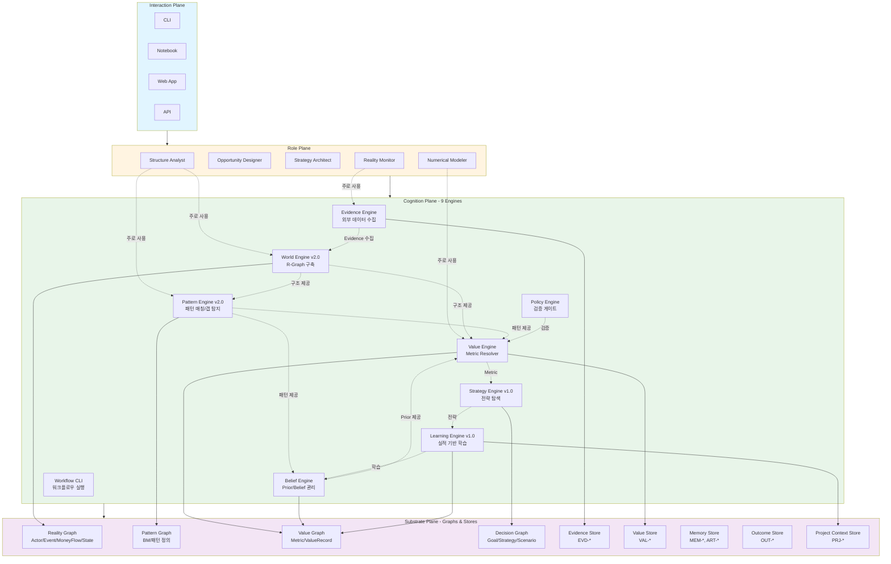

---

## 2. Greenfield vs Brownfield 워크플로우 분기

```mermaid
flowchart TD
    START([사용자 질문])
    
    MODE_CHECK{조직 컨텍스트<br/>필요?}
    
    subgraph GREENFIELD[Greenfield: 시장 전체 분석]
        GF_START[structure_analysis]
        GF_PHASES[Phase 1-14<br/>시장 구조/규모/경쟁]
        GF_OUTPUT[Market Reality Report<br/>시장 관점]
    end
    
    subgraph BROWNFIELD[Brownfield: 조직 통합 분석]
        BF_START[structure_analysis_for_project]
        PH00[Phase 0: Project Context Setup<br/>조직 현황/역량/제약]
        BF_PHASES[Phase 1-14<br/>시장 + 조직 통합 분석]
        BF_OUTPUT[Market Reality Report<br/>+ Position/Opportunity<br/>조직 관점]
    end
    
    START --> MODE_CHECK
    
    MODE_CHECK -->|"시장만 알면 됨"| GF_START
    MODE_CHECK -->|"우리 관점 필요"| BF_START
    
    GF_START --> GF_PHASES
    GF_PHASES --> GF_OUTPUT
    
    BF_START --> PH00
    PH00 --> BF_PHASES
    BF_PHASES --> BF_OUTPUT
    
    GF_OUTPUT --> END_GF([완료])
    BF_OUTPUT --> END_BF([완료])

    style GREENFIELD fill:#e1f5ff
    style BROWNFIELD fill:#fff4e1
    style PH00 fill:#ffeb3b,stroke:#f57c00,stroke-width:2px
    style MODE_CHECK fill:#e8f5e9
```

---

## 3. 전체 워크플로우 순서도 (Greenfield: 14 Phases)

**Note**: Greenfield = 시장 전체 분석, project_context_id 불필요

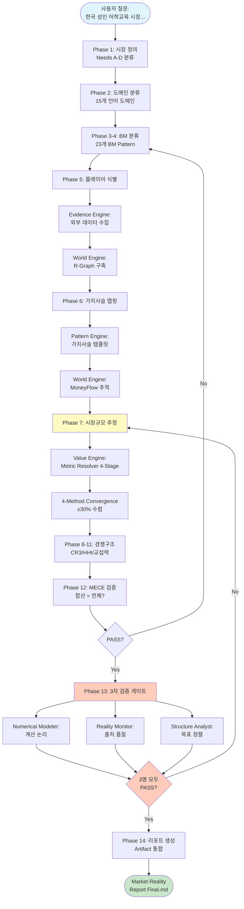

---

## 3. Phase 5: 플레이어 식별 & 데이터 수집 상세도

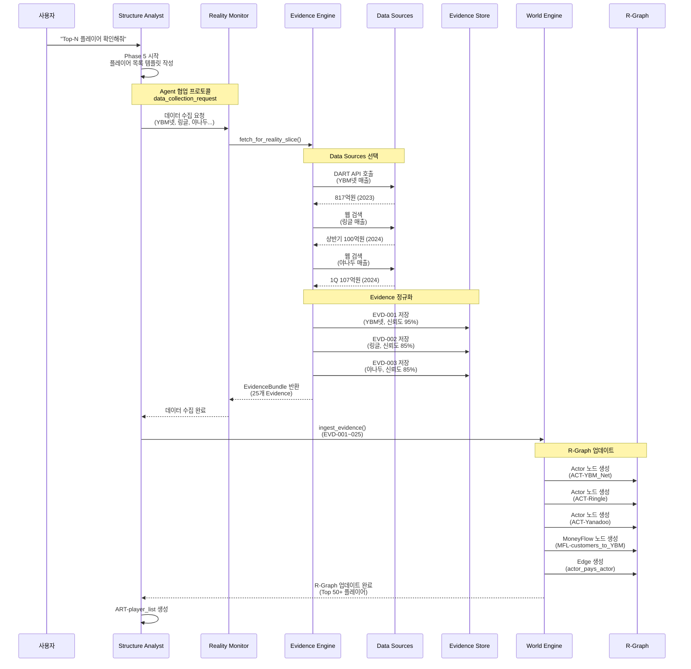

---

## 4. Phase 7: 시장규모 추정 (4-Stage Metric Resolver) 상세도

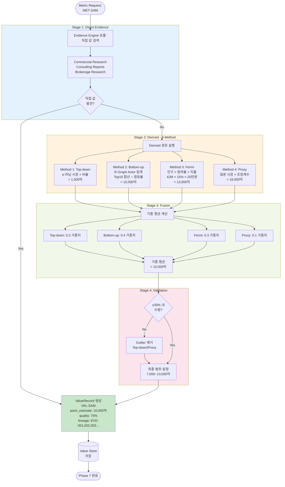

---

## 3-1. 전체 워크플로우 순서도 (Brownfield: 15 Phases)

**Note**: Brownfield = 조직 통합 분석, **PH00** + PH01-PH14

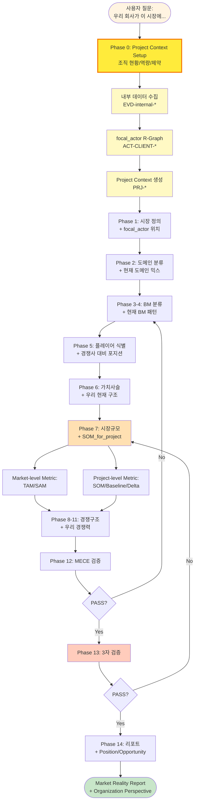

---

## 4. Phase 0: Project Context Setup (Brownfield 전용)

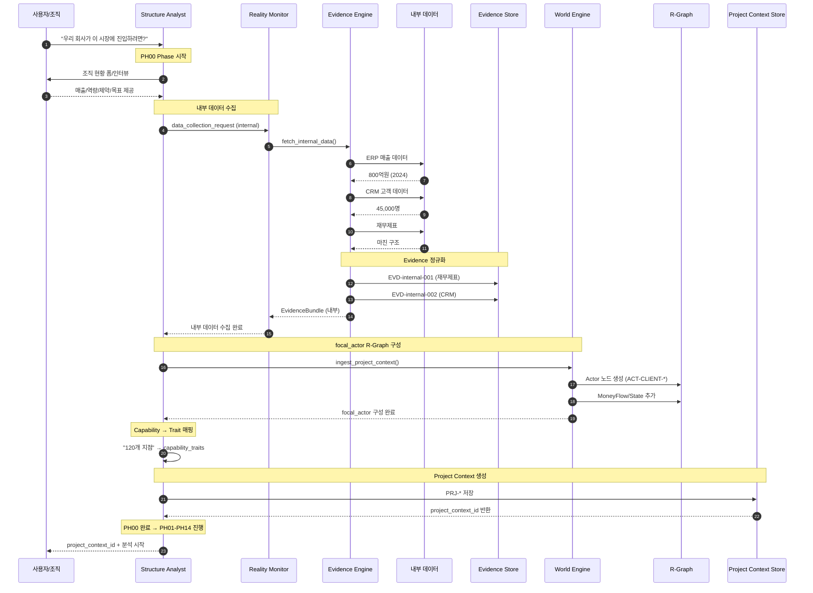

---

## 5. 데이터 흐름도 (Evidence → Graph → Report)

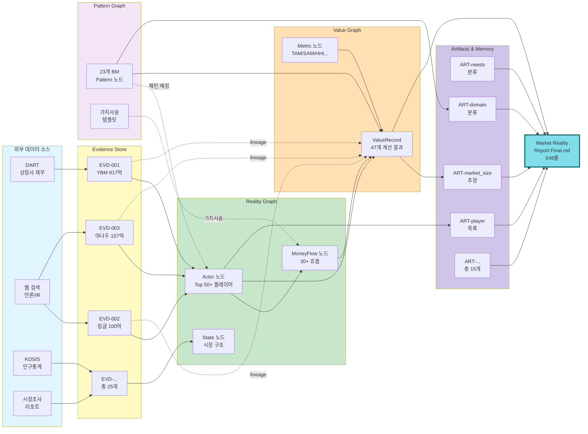

---

## 6. Phase 13: 3자 검증 게이트 상세도

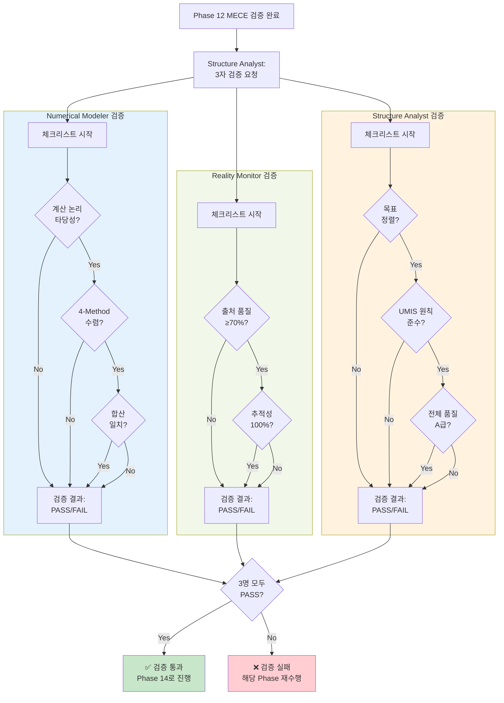

---

## 7. Value Engine 내부 구조도 (Metric Resolver + BeliefEngine)

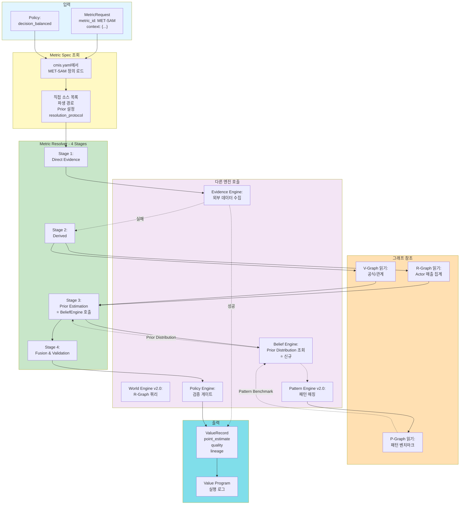

---

## 8. 협업 프로토콜 다이어그램

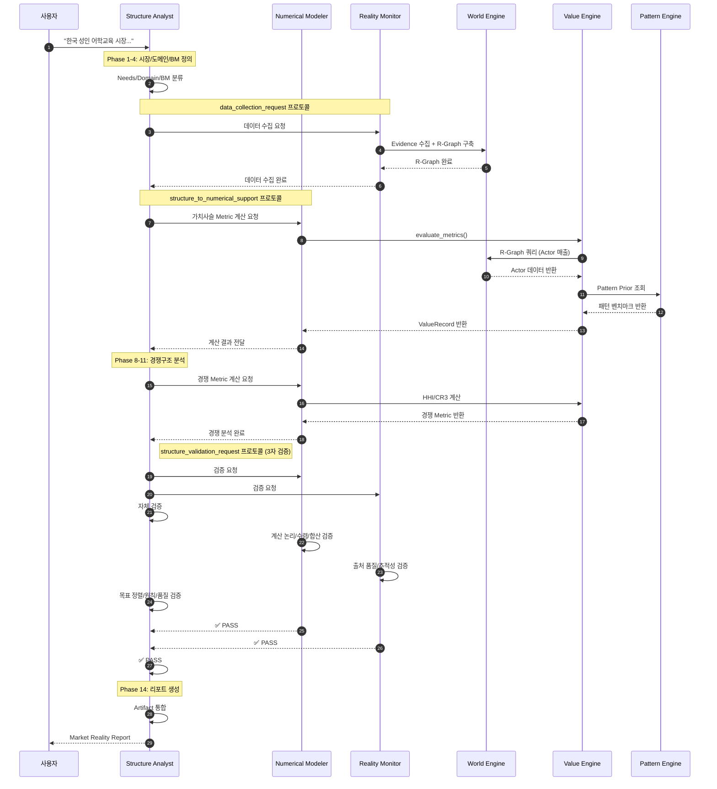

---

## 9. 전체 시스템 통합 다이어그램

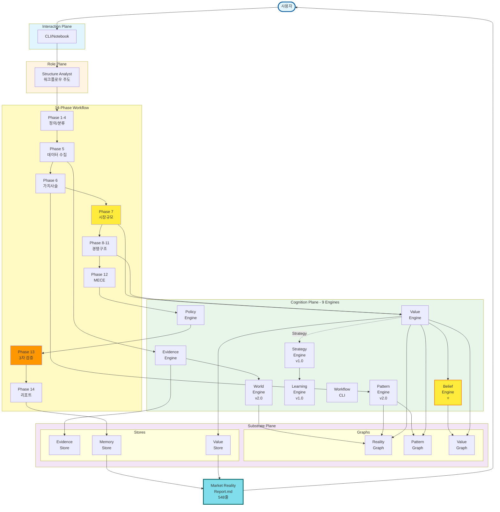

---

## 10. Lineage 추적 흐름도

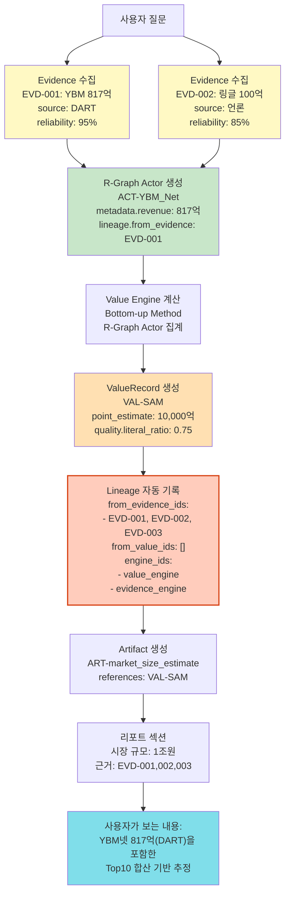

---

## 11. 4단계 루프 다이어그램 (CMIS 핵심)

**신규 추가 (2025-12-12)**:

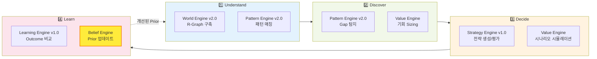

**4단계 루프 설명**:
1. **Understand** - 시장 구조/패턴 이해 (World + Pattern)
2. **Discover** - 기회/갭 발굴 (Pattern Gap + Value)
3. **Decide** - 전략 설계/선택 (Strategy + Value)
4. **Learn** - 실행 결과 학습 (Learning + Belief) → 다시 Understand로

---

## 12. BeliefEngine 통합 다이어그램 (신규)

**신규 추가 (2025-12-12)**:

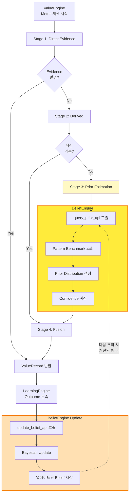

---

## 13. 문서 업데이트 요약

**2025-12-12 최신 업데이트** (v3.0):
- ✅ BeliefEngine 추가 (9번째 엔진)
- ✅ 4단계 루프 다이어그램 추가 (Understand → Discover → Decide → Learn)
- ✅ BeliefEngine 통합 다이어그램 추가
- ✅ ValueEngine 내부 구조 업데이트 (BeliefEngine 연동)
- ✅ Cognition Plane 9개 엔진 반영
- ✅ World Engine v2.0, Strategy Engine v1.0, Learning Engine v1.0 버전 표시
- ✅ Workflow CLI 추가

**2025-12-05 업데이트** (v2.0):
- ✅ Substrate Plane에 Project Context Store (PRJ-*) 추가
- ✅ Greenfield vs Brownfield 워크플로우 분기 다이어그램 추가
- ✅ Brownfield 15-Phase 순서도 추가 (PH00 포함)
- ✅ Phase 0: Project Context Setup 상세 시퀀스 다이어그램 추가

**다이어그램 목록** (총 15개):
1. 전체 아키텍처 (4 Planes + 9 Engines)
2. Greenfield vs Brownfield 분기
3. Greenfield 워크플로우 (14 Phases)
4. Brownfield 워크플로우 (15 Phases, PH00 포함)
5. Phase 0: Project Context Setup
6. Phase 5: 플레이어 식별
7. Phase 7: 시장규모 추정 (4-Stage Metric Resolver + BeliefEngine)
8. 데이터 흐름도
9. Phase 13: 3자 검증 게이트
10. Value Engine 내부 구조 (BeliefEngine 연동)
11. 협업 프로토콜
12. 전체 시스템 통합 (9 Engines)
13. Lineage 추적 흐름
14. **4단계 루프** (신규)
15. **BeliefEngine 통합** (신규)

---

**작성일**: 2025-12-12
**버전**: v3.0 (CMIS v3.3 기준, BeliefEngine 포함)
**상태**: Production Ready (9/9 엔진 완성)
**노트**: 이 다이어그램들은 Mermaid 형식으로 작성되어 GitHub/Markdown 렌더러에서 자동으로 시각화됩니다.

