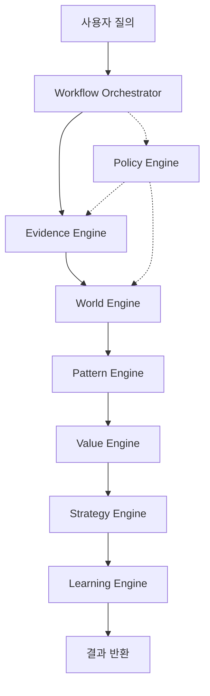

# CMIS 시스템 전체 개요

**생성일**: 2025-12-21 11:28:56
**목적**: NotebookLM 학습용 CMIS 시스템 전체 구조 및 철학

---

## 1. CMIS란?

**CMIS (Contextual Market Intelligence System)**는 시장 분석을 위한 Evidence-first 시스템입니다.

### 핵심 철학

1. **Evidence-first, Prior-last**: 증거 우선, 가정 최소화
2. **Substrate = SSoT**: Stores + Graphs + Lineage가 단일 진실 공급원
3. **Model → Number**: 구조 먼저 정의, 숫자는 나중
4. **Graph-of-Graphs**: Reality/Pattern/Value/Decision 그래프 분리
5. **Objective-Oriented**: 목표 중심, 프로세스 동적 조정
6. **Agent = Persona + Workflow**: 엔진은 도구, Agent는 워크플로우

---

## 2. 시스템 아키텍처

### 2.1 레지스트리 구조 (cmis.yaml)

```yaml
# 주요 섹션:
```

### 2.2 디렉토리 구조

```
cmis/
├── cmis.yaml              # 중앙 레지스트리
├── schemas/               # 타입 시스템
├── libraries/             # 도메인 지식
├── config/                # 런타임 설정
├── cmis_core/             # 9개 엔진 (핵심)
├── cmis_cli/              # CLI 인터페이스
└── dev/                   # 개발 자료
```

---

## 3. 9개 핵심 엔진

### 3.1 BeliefEngine
**파일**: `belief_engine.py`
**역할**: Prior 관리 및 Bayesian 업데이트

```
Belief Engine

Prior/Belief 관리 및 불확실성 정량화 엔진.

CMIS의 9번째이자 마지막 엔진으로,
Evidence가 부족할 때 Prior Distribution을 제공하고,
Outcome 기반으로 Belief를 업데이트하는 역할.

핵심 원칙:
- Evidence-first, Prior-last
- Conservative by Default
- Context-aware
- Monotonic Improvability
```

### 3.2 WorldEngine
**파일**: `world_engine.py`
**역할**: Reality Graph 구성 (Actor/Money/Event)

```
CMIS World Engine

Evidence → R-Graph 변환 및 snapshot 생성

Phase A: RealityGraphStore + ProjectOverlay + 필터링
2025-12-11: World Engine v2.0
```

### 3.3 PatternEngine
**파일**: `pattern_engine_v2.py`
**역할**: 패턴 매칭 및 Context 학습

```
Pattern Engine v2 - Phase 1 Core Infrastructure

Trait 기반 패턴 매칭 및 구조 적합도 계산

2025-12-10: v1.1 설계 반영
- PatternSpec 13개 필드
- PatternMatch 8개 필드
- Structure Fit (Trait + Graph)
- 5개 Pattern 지원
```

### 3.4 ValueEngine
**파일**: `value_engine.py`
**역할**: 가치 평가 및 밸류에이션

```
CMIS Value Engine

Metric 계산 및 Fusion 엔진
```

### 3.5 StrategyEngine
**파일**: `strategy_engine.py`
**역할**: 전략 생성 및 평가

```
Strategy Engine - 전략 설계 엔진

Goal/Pattern/Reality/Value 기반 전략 탐색 및 평가

Phase 1: Core Infrastructure + Public API
2025-12-11: StrategyEngine Phase 1
```

### 3.6 LearningEngine
**파일**: `learning_engine.py`
**역할**: 학습 및 피드백 루프

```
Learning Engine - 학습 및 피드백 루프

Outcome → 시스템 개선

Phase 1: Core Infrastructure
2025-12-11: LearningEngine Phase 1
```

### 3.7 EvidenceEngine
**파일**: `evidence_engine.py`
**역할**: 증거 수집 및 검증

```
CMIS Evidence Engine

Evidence 수집 및 관리 엔진 (v2 개정판)

설계 원칙:
- Evidence-first, Prior-last
- Early Return (상위 tier 성공 시 즉시 반환)
- Graceful Degradation (부분 실패 허용)
- Source-agnostic Interface
- Comprehensive Lineage

아키텍처:
- EvidenceEngine: Facade (public API)
- EvidencePlanner: Plan 생성
- EvidenceExecutor: Plan 실행
- SourceRegistry: Source 관리
- EvidenceStore: 캐싱/저장
```

### 3.8 PolicyEngine
**파일**: `policy_engine.py`
**역할**: 정책 적용 및 제약 관리

```
CMIS Policy Engine v2

목표:
- policies.yaml(v2)을 '정책 레지스트리/팩'으로 사용
- role/usage → mode(policy_id) 라우팅을 YAML로 선언
- mode = profiles(evidence/value/prior/convergence/orchestration) 조합
- gates 리스트로 "어떤 검증을 강제할지"를 선언
- PolicyEngine은:
  1) YAML 로딩
  2) mode → CompiledPolicy 컴파일(참조 해소)
  3) 엔진 힌트 제공(예: evidence 정책)
  4) 결과 평가(게이트 실행) + 구조화된 위반 리포트 생성

레거시(v1) 호환 없음.
```

### 3.9 WorkflowOrchestrator
**파일**: `workflow.py`
**역할**: 워크플로우 실행 및 조정

```
CMIS Workflow Orchestrator

canonical_workflows 기반 워크플로우 실행

v2.0: Generic workflow run + Role/Policy 통합
2025-12-11: Workflow CLI Phase 1
```

---

## 4. 데이터 흐름



---

## 5. 핵심 개념

### 5.1 Reality Graph
- Actor, MoneyFlow, Event, Resource, Contract 노드
- 실제 시장 구조를 그래프로 표현

### 5.2 Pattern Graph
- 비즈니스 패턴 (예: Marketplace, Subscription)
- Context와 Pattern 매칭

### 5.3 Value Graph
- Metric → Valuation → Outcome
- 불확실성 전파 (Monte Carlo)

### 5.4 Decision Graph
- Goal → Task → Verification
- 동적 재계획 (Reconcile Loop)

---

## 6. 실행 모드

### CLI 인터페이스

```bash
# 구조 분석
python -m cmis_cli structure-analysis --domain DOMAIN --actor ACTOR

# 기회 발견
python -m cmis_cli opportunity-discovery --context CONTEXT

# 워크플로우 실행
python -m cmis_cli workflow-run --workflow-id WF_ID
```

---

이 문서는 CMIS 시스템의 전체 개요를 제공합니다.
상세 구현은 후속 문서(01~09)를 참조하세요.
